

  

  <strong>UNIVERSIDAD DE BUENOS AIRES</strong> 
  Facultad de Ingeniería 
  TA134 – Sistemas Embebidos 
  Curso 1 – Grupo 3

# Memoria del Trabajo Final: Ascensor Embebido de 3 Pisos con Control de Acceso RFID

<table align="center">
  <tr>
    <th>Autor</th>
    <th>Padrón</th>
    <th>Mail</th>
  </tr>
  <tr>
    <td>Colodro, Felipe</td>
    <td>106.433</td>
    <td>fcolodro@fi.uba.ar</td>
  </tr>
  <tr>
    <td>dos Reis, Mariana</td>
    <td>111.545</td>
    <td>mdosreis@fi.uba.ar</td>
  </tr>  
  <tr>
    <td>Toscan, Uma</td>
    <td>111.106</td>
    <td>utoscan@fi.uba.ar</td>
  </tr>
</table>

  2026 | 1er Cuatrimestre

  Taller de Sistemas Embebidos (TA134)

  Universidad de Buenos Aires | Facultad de Ingeniería

# Resumen

En el presente trabajo se desarrolló una maqueta funcional de un ascensor de 3 paradas (Planta Baja, Piso 1 y Piso 2) basada en una placa STM32 Nucleo-F103RB, programada en lenguaje C bajo el paradigma Bare Metal (sin sistema operativo). El sistema gestiona el llamado de piso, el desplazamiento del motorreductor, la apertura/cierre de puerta, la detección de sobrecarga mediante celda de carga, y el control de acceso mediante tarjetas RFID.

El diseño de software se estructura mediante un **Ejecutor Cíclico (Super-Loop)** con base de tiempo de 1ms (SysTick → Callback), organizado en las etapas **Escrutar → Procesar → Actuar**, donde la etapa de Procesar implementa una **Máquina de Estados Finitos (FSM)** que gobierna el comportamiento del ascensor. La comunicación entre etapas se resuelve mediante una **cola de eventos** (array de estructuras), lo que permite que fuentes de entrada heterogéneas (botones físicos, comandos por Bluetooth, sensores) se traten de forma unificada.

El sistema cuenta además con persistencia de configuración en Flash interna, control de velocidad del motor por PWM, indicación visual (LEDs) y sonora (buzzer), pantalla LCD 16x2 por I2C, y un modo de configuración (SET_UP) con menú interactivo.

# Registro de versiones

| Revisión | Cambios realizados | Fecha |
| :---: | :--- | :---: |
| 1.0 | Creación del esqueleto y estructura base del documento. | 08/07/2026 |
| 1.1 | Redacción detallada, desarrollo y completado de las secciones del informe. | 20/09/2026 |

# Índice

- [Capítulo 1: Introducción general](#capítulo-1-introducción-general)
  - [1.1. Análisis de necesidad y objetivo](#11-análisis-de-necesidad-y-objetivo)
  - [1.2. Productos comparables](#12-productos-comparables)
  - [1.3. Alcance y limitaciones](#13-alcance-y-limitaciones)
- [Capítulo 2: Introducción específica](#capítulo-2-introducción-específica)
  - [2.1. Requisitos del proyecto](#21-requisitos-del-proyecto)
  - [2.2. Casos de uso](#22-casos-de-uso)
  - [2.3. Elementos de hardware](#23-elementos-de-hardware)
- [Capítulo 3: Diseño e implementación](#capítulo-3-diseño-e-implementación)
  - [3.1. Esquema eléctrico y conexionado](#31-esquema-eléctrico-y-conexionado)
  - [3.2. Descripción del comportamiento (Máquina de Estados)](#32-descripción-del-comportamiento-máquina-de-estados)
  - [3.3. Arquitectura del firmware](#33-arquitectura-del-firmware)
    - [3.3.1. Módulo Tick](#331-módulo-tick)
    - [3.3.2. Módulo Eventos](#332-módulo-eventos)
    - [3.3.3. Módulo Escrutar](#333-módulo-escrutar)
    - [3.3.4. Módulo FSM Ascensor](#334-módulo-fsm-ascensor)
    - [3.3.5. Módulo Actuadores](#335-módulo-actuadores)
    - [3.3.6. Módulo Configuración (Flash interna)](#336-módulo-configuración-flash-interna)
    - [3.3.7. Módulo RFID (RC522)](#337-módulo-rfid-rc522)
    - [3.3.8. Módulo Bluetooth (HM-10)](#338-módulo-bluetooth-hm-10)
- [Capítulo 4: Ensayos y resultados](#capítulo-4-ensayos-y-resultados)
  - [4.1. Prueba de integración (video)](#41-prueba-de-integración-video)
  - [4.2. Pruebas funcionales de hardware y firmware](#42-pruebas-funcionales-de-hardware-y-build-firmware)
  - [4.3. Salida de consola y Build Analyzer](#43-salida-de-consola-y-build-analyzer)
  - [4.4. Medición y análisis de tiempos de ejecución (WCET)](#44-medición-y-análisis-de-tiempos-de-ejecución-wcet)
  - [4.5. Cálculo del Factor de Uso (U) de la CPU](#45-cálculo-del-factor-de-uso-u-de-la-cpu)
  - [4.6. Medición y análisis de consumo](#46-medición-y-análisis-de-consumo)
  - [4.7. Cumplimiento de requisitos](#47-cumplimiento-de-requisitos)
- [Capítulo 5: Conclusiones](#capítulo-5-conclusiones)
  - [5.1. Resultados obtenidos](#51-resultados-obtenidos)
  - [5.2. Próximos pasos](#52-próximos-pasos)
- [Capítulo 6: Uso de herramientas de IA](#capítulo-6-uso-de-herramientas-de-ia)
- [Capítulo 7: Bibliografía](#capítulo-7-bibliografía)

# Capítulo 1: Introducción general

## 1.1. Análisis de necesidad y objetivo

Los edificios de baja altura con pocos pisos suelen requerir sistemas de ascensor simples, confiables y de bajo costo. Este tipo de sistema debe gestionar el llamado de piso, el desplazamiento seguro de la cabina, la apertura y cierre de puerta, y mecanismos básicos de seguridad como la detección de sobrecarga y la parada de emergencia.

El objetivo del proyecto es diseñar e implementar el firmware y el hardware de una maqueta de ascensor de 3 paradas, aplicando los contenidos fundamentales del Taller de Sistemas Embebidos: programación Bare Metal orientada a eventos, máquinas de estado, manejo de periféricos por polling/interrupciones/DMA, buses I2C y SPI, persistencia de configuración, y una interfaz de usuario mediante menú interactivo.

## 1.2. Productos comparables

A diferencia de los kits educativos de ascensores en miniatura disponibles comercialmente (que suelen ser de código cerrado y sin posibilidad de personalización), este proyecto propone un desarrollo abierto donde cada aspecto —desde el control de acceso por RFID hasta el bajo consumo— es diseñado e implementado por el equipo.

### Fundino elevador

Este sistema de formación para ascensores de cuatro plantas proporciona una plataforma que permite a alumnos y estudiantes llevar a cabo una amplia gama de tareas de programación de PLC utilizando el entorno de desarrollo Arduino sobre la base de una simulación realista de ascensor. Las aplicaciones eléctricas y mecánicas están estrechamente relacionadas y ofrecen un alto nivel de oportunidades de aprendizaje.

  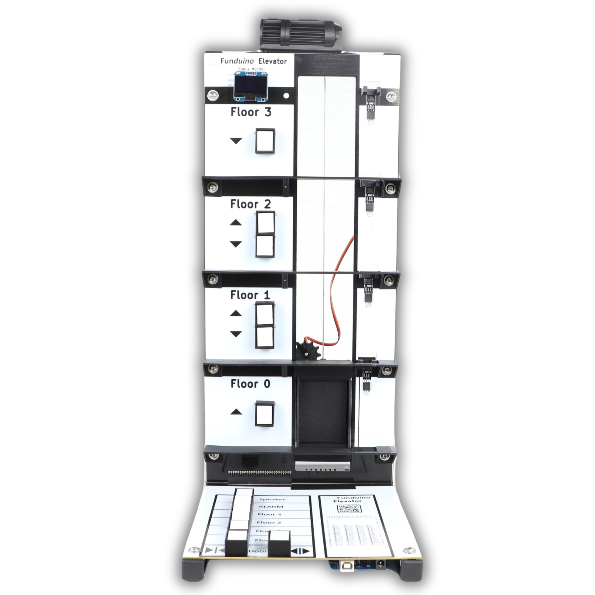 
  <em>Figura 1.1: Fundino elevador.</em>

### Ascensor Encoder

Los encoders son dispositivos que pueden convertir la posición o el movimiento de un eje a señales digitales que pueden ser leídas por un controlador lógico programable (PLC). En el caso de este proyecto, el encoder ayuda a determinar la posición exacta de la cabina entre los pisos y asegurar paradas precisas y suaves. Proyectos como este no solo son educativos, sino que también pueden ser muy gratificantes, ya que se ve una idea convertirse en una realidad funcional.

  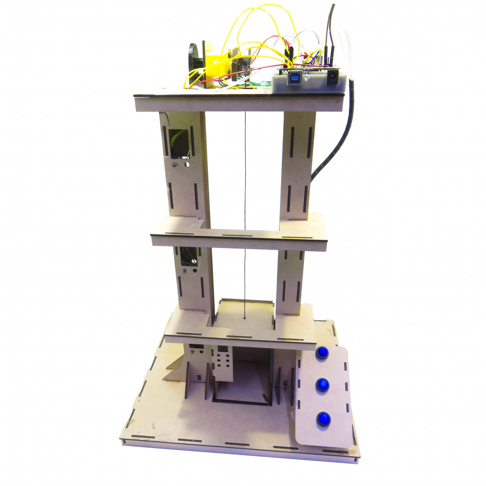 
  <em>Figura 1.2: Ascensor Encoder.</em>

La Tabla 1.1 contrasta las prestaciones de los dos productos comerciales de referencia contra el prototipo desarrollado en este trabajo.

| Aspecto | Funduino Elevator (4 niveles) | Ascensor Ecopech (3 pisos con Encoder) | Prototipo desarrollado (Ascensor Inteligente) |
| :--- | :--- | :--- | :--- |
| **Paradas** | 4 niveles | 3 pisos | 3 (Planta Baja, Piso 1 y Piso 2) |
| **Capacidad** | Maqueta educativa | Maqueta educativa | Detección de sobrecarga por celda de carga (umbral configurable) |
| **Máquina de tracción** | Motor DC con reductor y puente en H L293D | Motor DC | Motor DC con driver L298N y control por PWM |
| **Comandos** | Lógica 5V (Funduino MEGA 2560 R3) | Lógica 5V (Arduino Nano) | Lógica 3,3-5V (STM32F103 / F446RE) |
| **Interfaz de usuario** | Pantalla OLED, botoneras de piso (subida/bajada) y panel interior completo | Sensor Encoder y Buzzer (sin pantalla incluida en el kit base) | Pantalla LCD 16x2 (I2C) y botoneras interior/exterior |
| **Seguridad** | Barreras de luz por nivel y botón de alarma | Encoder para paradas precisas y suaves | Celda de carga (HX711) y botón de emergencia con prioridad absoluta |
| **Registro / Telemetría** | Conexión opcional para Bluetooth (módulo no incluido) | No especificado | Telemetría en tiempo real mediante Bluetooth (HM-10) |
| **Persistencia** | Basada en la memoria interna del microcontrolador | No especificado | Parámetros configurables persistidos en EEPROM externa / Flash interna |
| **Infraestructura** | Bastidor de perfil de aluminio 20x20 | Estructura en MDF y piezas 3D | Maqueta experimental de laboratorio, sin obra civil |
| **Precio** | 184,90 € (aprox. $190.000 ARS) | S/ 190.00 (aprox. $50.000 ARS) | Prototipo de laboratorio (Costo estimado: ~$55.000 ARS) |

<em>Tabla 1.1: Comparación de prestaciones entre productos comerciales y el prototipo desarrollado.</em>

En resumen, el mercado ofrece desde kits educativos básicos basados en Arduino con lógica simplificada, hasta instalaciones industriales certificadas de alto costo y código cerrado. Ninguna de estas soluciones combina la flexibilidad de un desarrollo Bare Metal en STM32 con funciones de seguridad avanzada (celda de carga) y telemetría activa por Bluetooth en un formato de aprendizaje abierto. Esto justifica el desarrollo de un sistema propio que integre control de precisión y auditoría remota con hardware accesible.

## 1.3. Alcance y limitaciones

**Alcance implementado:**
- **Electrónica de control:** Gestión de 3 paradas con lógica automática y control de motor por PWM.
- **Interfaz de usuario:** Botoneras (internas/externas), display LCD 16x2 y telemetría Bluetooth.
- **Seguridad:** Detección de sobrecarga (HX711) y botón de emergencia con prioridad absoluta.
- **Configuración:** Modo SET_UP con persistencia de parámetros en EEPROM externa / Flash interna.

**Fuera de alcance actual:**
- Diseño mecánico de infraestructura civil o edificio real (maqueta demostrativa).
- Escalabilidad a más de 3 paradas por restricciones de tiempo y presupuesto.

# Capítulo 2: Introducción específica

## 2.1. Requisitos del proyecto

En la Tabla 2.1 se detallan los principales requisitos funcionales del sistema:

| Grupo | ID | Descripción |
| :---- | :---- | :---- |
| Movimiento | 1.1 | El sistema desplazará la cabina entre 3 paradas: Planta Baja, Piso 1 y Piso 2. |
| | 1.2 | El sistema detectará la llegada a cada piso mediante un sensor reed switch dedicado. |
| | 1.3 | El sistema controlará la velocidad del motor mediante PWM. |
| | 1.4 | Si el viaje excede un tiempo máximo sin detectar llegada, el sistema pasará a estado de FALLA. |
| Llamado de piso | 2.1 | El sistema permitirá solicitar un piso mediante botonera externa (en cada piso) e interna (en la cabina). |
| | 2.2 | El sistema encolará pedidos pendientes si se solicitan mientras el ascensor está en movimiento. |
| Puerta | 3.1 | El sistema abrirá la puerta automáticamente al llegar a un piso. |
| | 3.2 | El sistema cerrará la puerta automáticamente tras un tiempo configurable de espera. |
| | 3.3 | El sistema verificará el cierre de puerta mediante sensor reed switch antes de iniciar un viaje. |
| Seguridad | 4.1 | El sistema detendrá el ascensor y abrirá la puerta ante la activación de la llave de emergencia. |
| | 4.2 | El sistema detectará sobrecarga mediante celda de carga y bloqueará nuevos viajes mientras esté activa. |
| | 4.3 | El sistema emitirá señales sonoras distintivas para llegada, tecla, sobrecarga, emergencia y falla. |
| Control de acceso | 5.1 | El sistema leerá el UID de tarjetas RFID mediante el módulo RC522. |
| | 5.2 | El sistema podrá restringir el llamado de piso a tarjetas autorizadas (configurable). |
| Interfaz de usuario | 6.1 | El sistema mostrará el piso actual y el estado del ascensor en un display LCD 16x2 por I2C. |
| | 6.2 | El sistema indicará mediante LEDs el estado de movimiento, puerta, SET_UP, falla y emergencia. |
| | 6.3 | El sistema permitirá control remoto (llamado de piso) mediante Bluetooth (HM-10). |
| Configuración (SET_UP) | 7.1 | El sistema contará con un modo SET_UP con menú interactivo por LCD y botones. |
| | 7.2 | El sistema permitirá configurar y persistir: tiempo de puerta abierta, umbral de sobrecarga y velocidad del motor. |
| | 7.3 | La configuración persistirá en Flash interna del microcontrolador entre reinicios. |
| Arquitectura de software | 8.1 | El sistema se implementará Bare Metal, sin sistema operativo, bajo el paradigma Event-Triggered. |
| | 8.2 | El sistema utilizará un Ejecutor Cíclico (Super-Loop) con una vuelta completa menor a 1ms. |
| | 8.3 | El sistema utilizará una base de tiempo de 1ms (SysTick → Callback) para todas las temporizaciones. |
| | 8.4 | Todas las tareas serán no bloqueantes (temporizadas o no temporizadas), sin uso de `HAL_Delay()` en la lógica de aplicación. |

<em>Tabla 2.1: Requisitos del proyecto.</em>

## 2.2. Casos de uso

### 2.2.1. Caso de uso 1: Un usuario llama al ascensor desde un piso

| Elemento | Definición |
| :---- | :---- |
| Disparador | Un usuario presiona el botón externo de llamado en Planta Baja, Piso 1 o Piso 2. |
| Precondiciones | El sistema está en modo NORMAL, en estado IDLE (o con otro pedido pendiente), sin sobrecarga activa. |
| Flujo principal | El botón genera un evento de pedido de piso, que se encola en la lista de pedidos pendientes. Si el ascensor está en IDLE, cierra la puerta (si estaba abierta), viaja al piso solicitado controlando el motor por PWM, detiene el motor al detectar el reed switch del piso destino, y abre la puerta automáticamente. |

<em>Tabla 2.2: Caso de uso 1.</em>

### 2.2.2. Caso de uso 2: Se activa la llave de emergencia durante un viaje

| Elemento | Definición |
| :---- | :---- |
| Disparador | El usuario acciona la llave de emergencia mientras el ascensor está en movimiento. |
| Precondiciones | El sistema está en cualquier estado que no sea ya EMERGENCIA. |
| Flujo principal | El sistema detiene el motor de inmediato, abre la puerta, enciende el LED de emergencia, activa el buzzer en patrón continuo y muestra el aviso en el LCD, independientemente del estado en el que se encontraba. El sistema permanece en este estado hasta que la llave vuelve a su posición normal. |

<em>Tabla 2.3: Caso de uso 2.</em>

### 2.2.3. Caso de uso 3: Un usuario configura los parámetros del sistema (modo SET_UP)

| Elemento | Definición |
| :---- | :---- |
| Disparador | El usuario mantiene presionado el botón interno de Planta Baja durante el encendido del sistema. |
| Precondiciones | El sistema está apagado o acaba de reiniciarse. |
| Flujo principal | El sistema arranca en modo SET_UP en lugar de NORMAL. El usuario navega entre los parámetros configurables (tiempo de puerta, umbral de sobrecarga, velocidad de motor) usando el botón de Planta Baja como "navegar" y el de Piso 2 como "incrementar valor". Al llegar a la opción "Guardar y salir" y confirmar (llave de emergencia), el sistema persiste los valores en Flash interna y puede reiniciarse en modo NORMAL. |

<em>Tabla 2.4: Caso de uso 3.</em>

### 2.2.4. Caso de uso 4: Control de acceso mediante tarjeta RFID

| Elemento | Definición |
| :---- | :---- |
| Disparador | El usuario acerca una tarjeta/llavero RFID al módulo RC522. |
| Precondiciones | El sistema tiene habilitado el control de acceso (`ACCESO_RFID_REQUERIDO = 1`). |
| Flujo principal | El sistema lee el UID de la tarjeta mediante el protocolo REQA + anticolisión sobre SPI. Si el UID coincide con la lista de tarjetas autorizadas, se habilita el llamado de piso; caso contrario, se rechaza el pedido y se indica mediante LCD/buzzer. |

<em>Tabla 2.5: Caso de uso 4.</em>

## 2.3. Elementos de hardware

### 2.3.1. Placa de desarrollo

<table>
  <tr>
    <td width="60%" valign="top">
      
Como unidad central de procesamiento se utilizó la placa <strong>STM32 Nucleo-F103RB</strong>, compatible con el ecosistema HAL/CubeMX.

      
Gestiona toda la lógica del ascensor mediante una máquina de estados, el manejo de tiempos críticos mediante SysTick y TIM2 (PWM), y la comunicación con los periféricos mediante I2C1, SPI1 y USART3.

    </td>
    <td width="40%" align="center">
      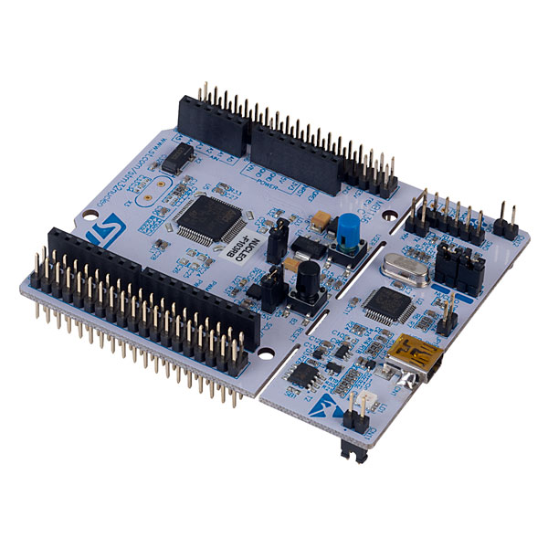 
      <em>Figura 2.1: Nucleo-F103RB utilizada.</em>
    </td>
  </tr>
</table>

### 2.3.2. Motor y driver L298N

<table>
  <tr>
    <td width="60%" valign="top">
      
Se utilizó un motorreductor DC de 12V acoplado a una polea para el sistema de tracción de la cabina, controlado a través de un driver <strong>L298N</strong> (puente H).

      
La dirección de giro se controla mediante los pines IN1/IN2 (GPIO), y la velocidad mediante PWM sobre el pin ENA (TIM2_CH1).

    </td>
    <td width="40%" align="center">
      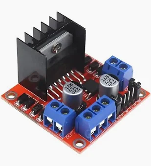 
      <em>Figura 2.2: Motorreductor y driver L298N.</em>
    </td>
  </tr>
</table>

### 2.3.3. Celda de carga + HX711

<table>
  <tr>
    <td width="60%" valign="top">
      
Para la detección de sobrecarga se utilizó una celda de carga tipo barra recta de 3kg, junto al amplificador <strong>HX711</strong>, que entrega el dato mediante un protocolo propio de 2 hilos (DT/SCK).

    </td>
    <td width="40%" align="center">
      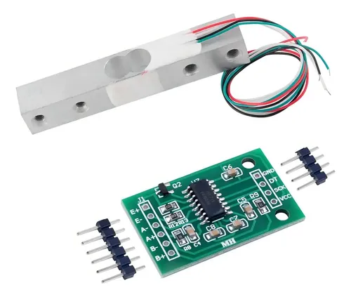 
      <em>Figura 2.3: Celda de carga y HX711.</em>
    </td>
  </tr>
</table>

### 2.3.4. Display LCD 16x2 (I2C)

<table>
  <tr>
    <td width="60%" valign="top">
      
Se utilizó un display LCD 16x2 con backpack I2C (PCF8574), que muestra el piso actual, el estado del ascensor y el menú de configuración (SET_UP).

    </td>
    <td width="40%" align="center">
      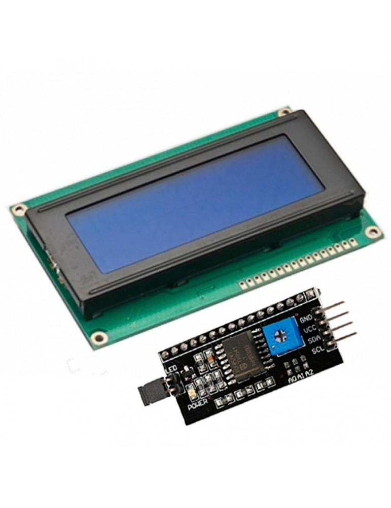 
      <em>Figura 2.4: LCD 16x2 utilizado.</em>
    </td>
  </tr>
</table>

### 2.3.5. Módulo RFID RC522 (SPI)

<table>
  <tr>
    <td width="60%" valign="top">
      
Se integró un módulo lector RFID <strong>RC522</strong> por SPI1, utilizado para el control de acceso opcional mediante tarjetas/llaveros.

    </td>
    <td width="40%" align="center">
      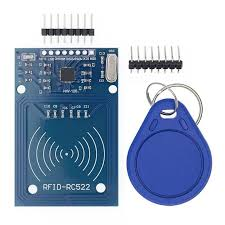 
      <em>Figura 2.5: Módulo RC522.</em>
    </td>
  </tr>
</table>

### 2.3.6. Módulo Bluetooth HM-10 (UART)

<table>
  <tr>
    <td width="60%" valign="top">
      
Se utilizó un módulo HM-10 (Bluetooth Low Energy) sobre USART3 para permitir el llamado de piso de forma remota desde una aplicación de celular.

    </td>
    <td width="40%" align="center">
      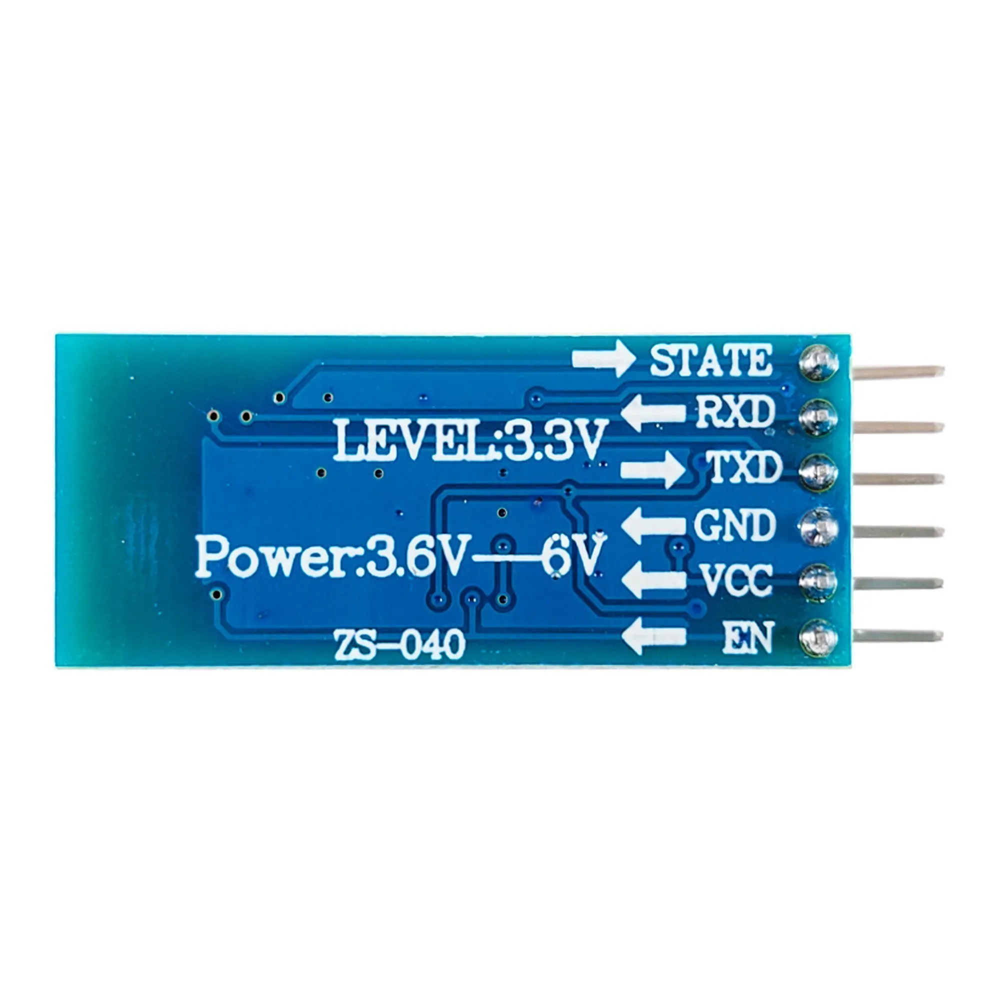 
      <em>Figura 2.6: Módulo HM-10.</em>
    </td>
  </tr>
</table>

### 2.3.7. Botones, reed switches y llave de emergencia

<table>
  <tr>
    <td width="60%" valign="top">
      
Se utilizaron 6 pulsadores (3 botoneras externas de piso + 3 botoneras de cabina), 3 sensores reed switch (uno por piso, para detección de llegada) y una llave de emergencia tipo switch mantenido.

    </td>
    <td width="40%" align="center">
      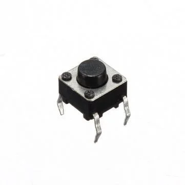
      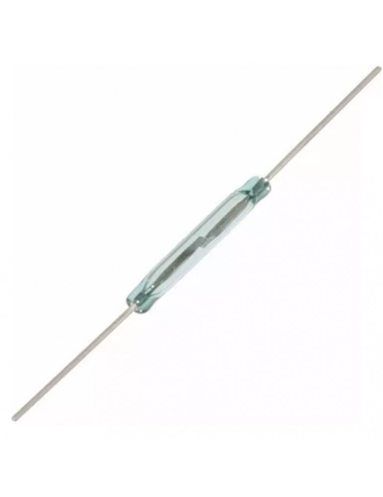 
      <em>Figura 2.7: Botones y sensores utilizados.</em>
    </td>
  </tr>
</table>

### 2.3.8. LEDs y buzzer

<table>
  <tr>
    <td width="60%" valign="top">
      
Se utilizaron 3 LEDs indicadores y un buzzer activo para señalización sonora de eventos (llegada, tecla, sobrecarga, emergencia, falla).

    </td>
    <td width="40%" align="center">
      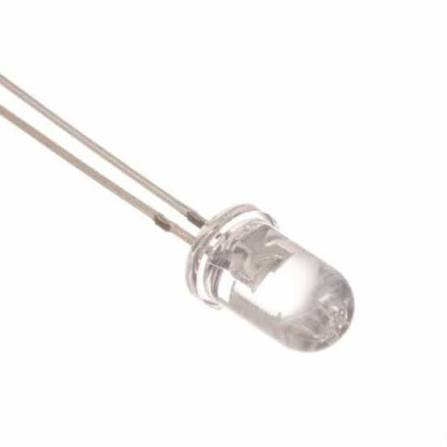
      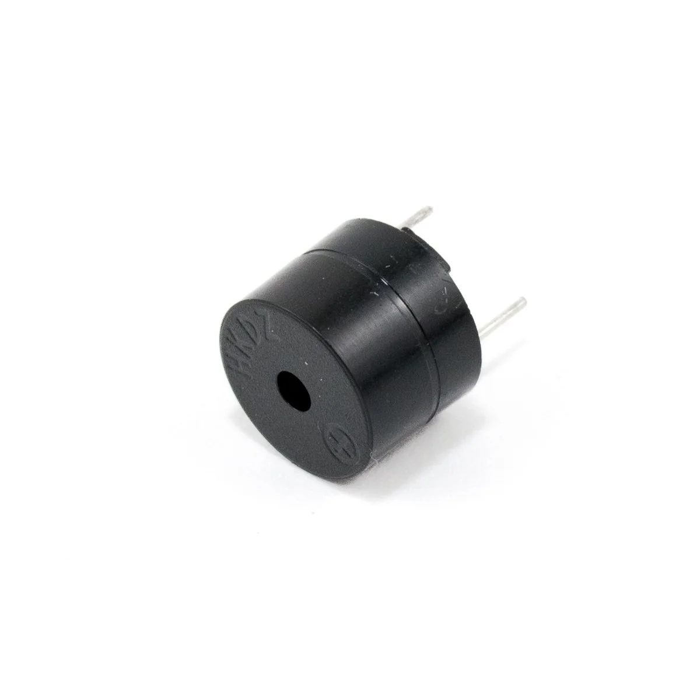 
      <em>Figura 2.8: LEDs y buzzer.</em>
    </td>
  </tr>
</table>

# Capítulo 3: Diseño e implementación

## 3.1. Esquema eléctrico y conexionado

Para la integración física del sistema se utilizó una placa experimental soldada (sin protoboard ni cables Dupont), con interconexión de componentes mediante cables soldados. El circuito se centra en la placa Nucleo-F103RB, que gestiona los periféricos mediante las siguientes interfaces:

- **GPIO (entradas):** botones de llamado externo/interno, reed switches de piso, llave de emergencia.
- **GPIO (salidas):** LEDs indicadores, buzzer, direccionamiento del motor (IN1/IN2).
- **PWM (TIM2_CH1):** control de velocidad del motor a través de ENA del L298N.
- **I2C1 (PB8=SCL, PB9=SDA):** display LCD.
- **SPI1 (PA5=SCK, PA6=MISO, PA7=MOSI):** módulo RFID RC522.
- **USART3 (PB10=TX, PB11=RX):** módulo Bluetooth HM-10.
- **2 hilos bit-banged (PC4=DT, PC5=SCK):** amplificador de celda de carga HX711.

En la Tabla 3.1 se detalla la asignación completa de pines:

| Bloque | Señal | Pin STM32 | Configuración |
| :---- | :---- | :---- | :---- |
| Reed switches | PB / P1 / P2 | PC6 / PC7 / PC8 | GPIO_Input |
| Botones externos | PB / P1 / P2 | PC9 / PC10 / PC11 | GPIO_Input |
| Botonera de cabina | PB / P1 / P2 | PC12 / PB1 / PB2 | GPIO_Input |
| Llave de emergencia | — | PB12 | GPIO_Input |
| LEDs de piso | PB / P1 / P2 | PB3 / PB4 / PB5 | GPIO_Output |
| Buzzer | — | PB13 | GPIO_Output |
| Motor L298N | IN1 / IN2 | PC0 / PC1 | GPIO_Output |
| Motor L298N | ENA | PA0 | TIM2_CH1 (PWM) |
| LCD I2C1 | SCL / SDA | PB8 / PB9 | I2C1 |
| RC522 SPI1 | SCK / MISO / MOSI | PA5 / PA6 / PA7 | SPI1 |
| RC522 | RST / CS | PA9 / PB6 | GPIO_Output |
| HX711 | DT / SCK | PC4 / PC5 | GPIO_Input / GPIO_Output |
| HM-10 USART3 | TX / RX | PB10 / PB11 | USART3 |

<em>Tabla 3.1: Asignación de pines del sistema.</em>

  

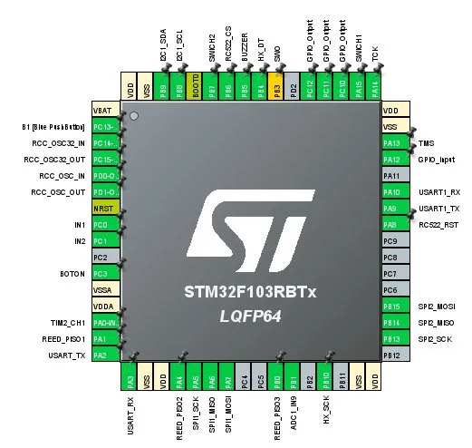 
<em>Figura 3.1: Configuración de pines en STM32CubeMX (.ioc).</em>

  

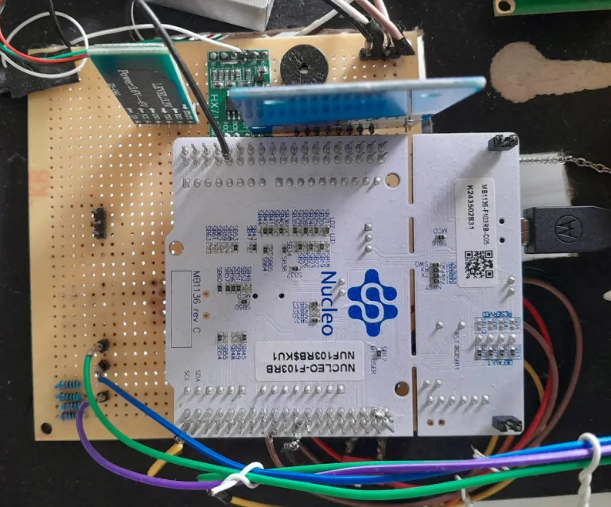 
<em>Figura 3.2: Placa experimental soldada de frente.</em>

  

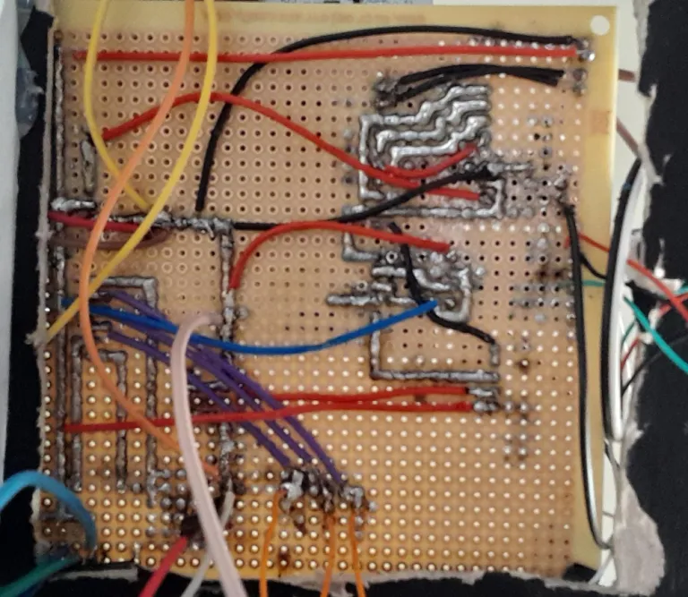 
<em>Figura 3.3: Placa experimental soldada de dorso.</em>

  

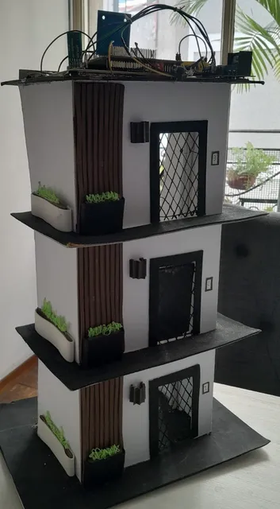 
<em>Figura 3.4: Maqueta mecánica completa del ascensor de frente.</em>

  

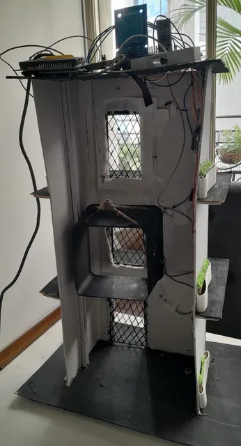 
<em>Figura 3.5: Maqueta mecánica completa del ascensor de dorso.</em>

  

## 3.2. Descripción del comportamiento (Máquina de Estados)

El comportamiento del ascensor se modela mediante una máquina de estados finitos con los siguientes estados: `IDLE`, `PUERTA_ABRIENDO`, `PUERTA_ABIERTA`, `PUERTA_CERRANDO`, `VIAJANDO`, `EMERGENCIA` y `FALLA`.

Desde `IDLE`, ante un pedido de piso pendiente, el sistema transiciona a `PUERTA_CERRANDO` (asegurando el cierre antes de cualquier viaje). Al confirmarse el cierre por el reed switch de puerta, se pasa a `VIAJANDO`, activando el motor en la dirección correspondiente (subiendo o bajando según el piso destino) y armando un temporizador de viaje (watchdog). Al detectar la llegada al piso destino mediante el reed switch correspondiente, se detiene el motor y se transiciona a `PUERTA_ABRIENDO` y luego a `PUERTA_ABIERTA`, donde permanece durante un tiempo configurable antes de volver a cerrar.

Los estados `EMERGENCIA` y `FALLA` tienen prioridad absoluta: cualquier evento de activación de la llave de emergencia interrumpe el estado actual (sin importar cuál sea) y lleva al sistema a `EMERGENCIA`. El estado `FALLA` se alcanza si el temporizador de viaje vence sin detectar llegada (posible reed switch desalineado o motor trabado).

  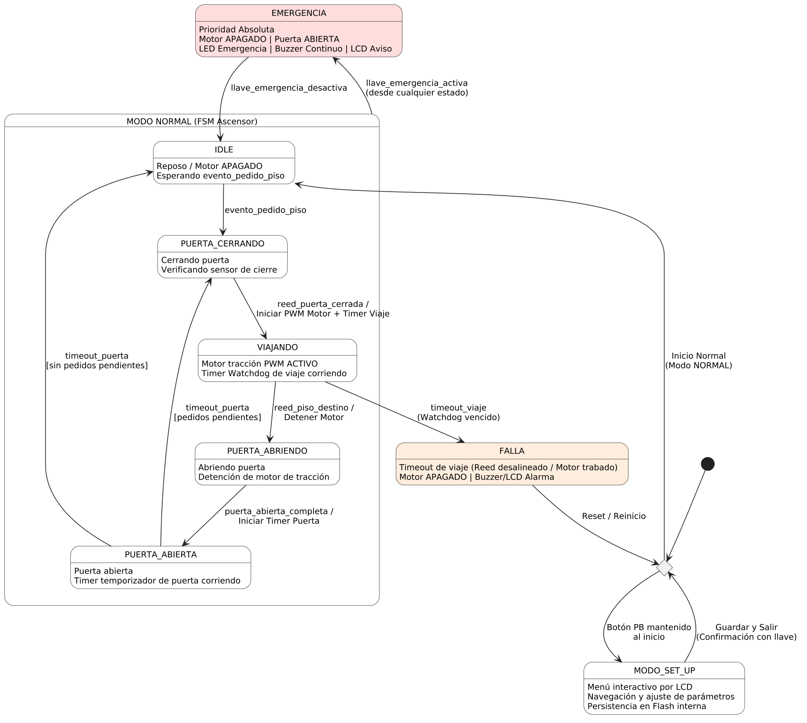 
  <em>Figura 3.6: Máquina de estados del sistema.</em>

## 3.3. Arquitectura del firmware

El firmware se estructura en las etapas **Escrutar → Procesar → Actuar**, comunicadas mediante una cola de eventos, sobre un Ejecutor Cíclico con tick de 1ms. Ningún módulo utiliza `HAL_Delay()` en su lógica de operación regular.

  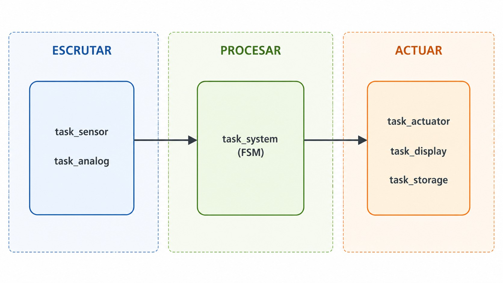 
  <em>Figura 3.5: Orden de despacho de las tareas dentro de una vuelta del ejecutivo cíclico.</em>

### 3.3.1. Módulo Tick

Provee la base de tiempo de 1ms mediante el callback de SysTick (`HAL_SYSTICK_Callback`), y una utilidad de temporizador no bloqueante (`temporizador_t`) usada por todos los demás módulos para medir tiempos sin bloquear el super-loop.

### 3.3.2. Módulo Eventos

Implementa una cola FIFO circular (array de estructuras) que desacopla la etapa de Escrutar de la etapa de Procesar. Cualquier fuente de entrada (botón físico, comando Bluetooth, sensor) empuja el mismo tipo de evento, permitiendo que la máquina de estados no distinga el origen.

### 3.3.3. Módulo Escrutar

Realiza el polling con antirrebote por software de los 6 botones, 3 reed switches y la llave de emergencia, y el polling de la celda de carga (HX711), generando eventos ante cada cambio de estado relevante.

### 3.3.4. Módulo FSM Ascensor

Implementa la máquina de estados descrita en la sección 3.2, incluyendo la lista de pedidos pendientes por piso y la lógica de selección del próximo destino.

### 3.3.5. Módulo Actuadores

Conjunto de drivers de bajo nivel para motor (PWM + dirección), LEDs, buzzer (con patrones no bloqueantes) y LCD (I2C).

### 3.3.6. Módulo Configuración (Flash interna)

Persiste los parámetros configurables (tiempo de puerta, umbral de sobrecarga, velocidad de motor) en un sector de Flash interna del STM32F103RB, con verificación por checksum ante lecturas de sectores no inicializados.

### 3.3.7. Módulo RFID (RC522)

Implementa la inicialización del chip MFRC522 y la lectura de UID mediante REQA + anticolisión de nivel 1 sobre SPI1, comparando contra una lista de UIDs autorizados.

### 3.3.8. Módulo Bluetooth (HM-10)

Recepción de comandos por USART3 mediante interrupción (no polling bloqueante), permitiendo el llamado de piso remoto desde una aplicación de celular.

# Capítulo 4: Ensayos y resultados

## 4.1. Prueba de integración (video)

En el video disponible en el siguiente enlace [VIDEO](https://drive.google.com/file/d/1JfSwkdtGOohkIxRKn3G9b7csXOrkRucz/view?usp=sharing) se muestra el funcionamiento completo del prototipo, partiendo desde el estado de reposo (Idle) hasta la llegada exitosa al piso solicitado mediante el llamado por botonera. Asimismo, se expone la respuesta del sistema ante el bloqueo por sobrecarga y la interrupción inmediata del viaje al accionar el botón de emergencia.

## 4.2. Pruebas funcionales de hardware y firmware

| Subsistema | Ensayo realizado | Resultado / Criterio de validación | Estado |
| :--- | :--- | :--- | :---: |
| **Hardware** | Verificación de continuidad | Ausencia de cortocircuitos o falsos contactos en la placa experimental | ✅ |
| **Hardware** | Respuesta correcta de botoneras y reed switches | Mapeo correcto de botoneras (interior/exterior) y sensores de piso/puerta a sus eventos | ✅ |
| **Hardware** | Correcta visualización del LCD | Actualización en tiempo real del piso actual y mensajes de estado | ✅ |
| **Hardware** | Correcto funcionamiento de la celda de carga | Lectura estable por I2C y detección de sobrecarga ante un peso conocido | ✅ |
| **Firmware** | FSM de antirrebote de pulsadores y reed switches | Filtrado exitoso de rebotes mecánicos sin pérdida de eventos | ✅ |
| **Firmware** | Correcta interpretación de la celda de carga | Mapeo estable de las lecturas del HX711 a la detección de sobrecarga por software | ✅ |
| **Firmware** | Persistencia en EEPROM externa | Lectura y escritura correcta de parámetros de configuración por bus I²C | ✅ |
| **Firmware** | Máquina de estados global | Transiciones robustas entre IDLE, viaje y puerta, con prioridad absoluta de la emergencia | ✅ |

<em>Tabla 4.1: Resumen de ensayos funcionales de hardware y firmware.</em>

## 4.3. Salida de consola y Build Analyzer

Al finalizar la compilación en STM32CubeIDE, el entorno genera automáticamente el Build Analyzer, una vista que desglosa el uso de memoria FLASH y RAM del binario resultante. La Figura 4.2 muestra este reporte, sirviendo como evidencia de que el firmware del ascensor compila correctamente sobre el STM32F103RB.

<em>Figura 4.1: Reporte de uso de memoria RAM y FLASH.</em>

Con el fin de facilitar la interpretación de estos resultados, la Tabla 4.2 desglosa el aporte de cada sección del binario a la ocupación real de las regiones físicas de memoria del STM32F103RB.

| Región Física | Usado [Bytes] | Total Disponible [Bytes] | Ocupación |
| :--- | :---: | :---: | :---: |
| RAM | 3.16 K | 20 K | 15.78% |
| FLASH |  43.23 K | 128 K | 33.77% |

<em>Tabla 4.2: Desglose de secciones del binario y ocupación de memoria.</em>

Como se desprende de la métrica final, el firmware utiliza aproximadamente un 16% de la memoria de programa (FLASH) disponible y un 34% de la memoria dinámica (RAM), dejando un margen operativo holgado. Asimismo, no se observaron fallos ni advertencias del linker que indiquen pérdida excesiva de memoria durante la compilación.

## 4.4. Medición y análisis de tiempos de ejecución (WCET)

En esta sección se busca comprender el comportamiento temporal del programa en la búsqueda de cumplir con los requisitos de tiempo del ejecutor cíclico. Para esto se observa la variable **WCET** (*Worst-Case Execution Time*), que muestra el peor caso de ejecución de una tarea durante su depuración. La misma se obtiene invocando el contador de ciclos del **DWT** (*Data Watchpoint and Trace*) del Cortex-M3, que mide el tiempo de ejecución de cada tarea del super-loop. Dado que las tareas más costosas son las que definen el peor caso, se procedió a depurar el sistema simulando un ciclo de uso completo del ascensor: un viaje entre pisos, un evento de sobrecarga y la interrupción por emergencia, de forma de recorrer todas las ramas de código disponibles.

La Figura 4.3 muestra los resultados observados en la pantalla *Live Expressions* del depurador de STM32CubeIDE.

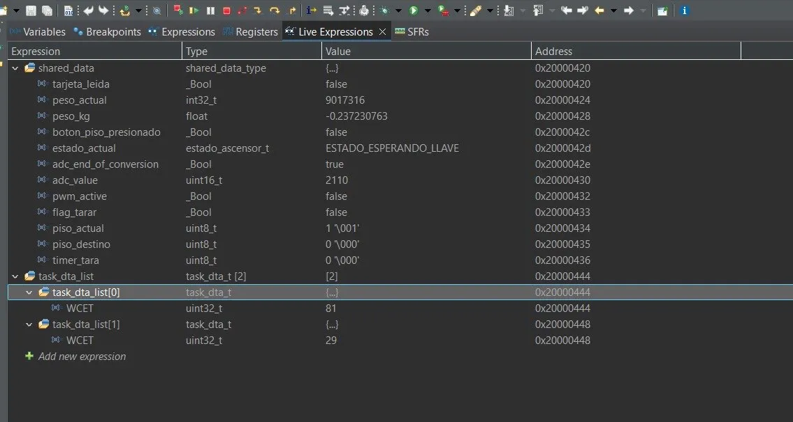

<em>Figura 4.2: Pantalla de Live Expressions con los peores tiempos de ejecución.</em>

Se toman en cuenta los tiempos medidos para cada tarea del super-loop, correspondientes a las etapas Escrutar → Procesar → Actuar descritas en el Capítulo 3. El valor de cada una es el tiempo en microsegundos (µs) devuelto por el DWT. En la Tabla 4.3 se detalla el WCET medido de cada tarea.

| Tarea | WCET medido (µs) |
| :--- | :---: |
| task_dta_list[0] | 81 |
| task_dta_list[1] | 29 |
| **TOTAL (ciclo completo)** | **110** |

<em>Tabla 4.3: Peores casos de tiempo de ejecución según tarea.</em>

Como se observa, en el peor de los casos —cuando se acumulan todos los peores tiempos de ejecución— se obtiene un WCET total de 110 µs. Este resultado cumple holgadamente con el requisito de tiempo del ejecutor cíclico de 1000 µs (1 ms), dejando un amplio margen operativo disponible de 890 µs (un 89 % de holgura) en cada vuelta del super-loop.
La tarea que resultó más costosa dentro del ciclo fue task_dta_list[0] con 81 µs, la cual domina el tiempo de ejecución al concentrar el escrutinio de entradas, el procesamiento de sensores y la lógica de la máquina de estados (en comparación con los 29 µs de task_dta_list[1]). Esta tarea se encuentra ajustada al mínimo necesario gracias a la arquitectura Bare Metal no bloqueante implementada, la cual garantiza un comportamiento determinístico y confirma que el sistema posee margen suficiente para incorporar nuevas funcionalidades sin arriesgar los tiempos de respuesta.

## 4.5. Cálculo del Factor de Uso (U) de la CPU

El factor de uso de la CPU se define como el cociente entre el tiempo de cómputo del peor caso (C) y el período de despacho del ejecutor cíclico (T), según la Ecuación (4.1):

$$U = \frac{C}{T} \qquad (4.1)$$

donde T = 1000 µs es el período fijado por el SysTick.

Reemplazando C con el WCET total obtenido en la Tabla 4.3 (110 µs), se obtiene un Factor de Uso de 0,11 (es decir, un 11% del tiempo disponible en cada vuelta del ciclo). Esto deja un 89% del tiempo en el que el microcontrolador no está ejecutando tareas.

Cabe aclarar que esta estimación corresponde al peor caso absoluto: ocurre únicamente cuando se combinan en la misma vuelta las tareas más costosas (por ejemplo, un evento simultáneo de sobrecarga y actualización de LCD). En el régimen habitual de operación —ascensor en reposo (IDLE) esperando un pedido de piso— el tiempo de ejecución real es sensiblemente menor, ya que la mayoría de las tareas del super-loop no tienen trabajo pendiente en cada vuelta.

Dado que la condición de planificabilidad U < 1 se cumple con holgura incluso en el pico de mayor exigencia, se concluye que el factor de uso de la CPU es acorde a los requisitos de tiempo real del sistema y deja margen operativo disponible para las mejoras y expansiones propuestas en la sección 5.2.

## 4.6. Medición y análisis de consumo

Se midió el consumo energético del sistema colocando un miliamperímetro en modo amperímetro en serie con la alimentación, sobre los rieles de 3,3V (STM32F103, LCD, celda de carga, Bluetooth) y 5V (driver de motor L298N), mientras el ascensor ejecutaba las distintas tareas de su ciclo normal de operación. Se utilizó además un osciloscopio para verificar la estabilidad de ambos rieles ante los picos de corriente del motor. Tomando en cuenta la tensión de cada riel, se utiliza ese dato junto con la Ecuación (4.2) para calcular la potencia consumida.

$$P = V \times I \qquad (4.2)$$

La Tabla 4.4 resume el consumo medido en los distintos modos de operación del sistema, discriminado por riel de alimentación.

| Modo de operación | Riel | Corriente consumida [mA] | Potencia consumida [mW] |
| :--- | :---: | :---: | :---: |
| Reposo (IDLE, sin pedidos pendientes) | 3.3 V | 45 | 148.5 |
| Reposo (IDLE, sin pedidos pendientes) | 5 V | 45 | 225 |
| Viaje en curso (motor + driver L298N activos) | 3.3 V | 55 | 181.5 |
| Viaje en curso (motor + driver L298N activos) | 5 V | 350 | 1750 |
| LCD + Bluetooth activos simultáneamente | 3.3 V | 60 | 198 |

<em>Tabla 4.4: Consumo energético del sistema por modo de operación y riel de alimentación.</em>

Como se observa en la Tabla 4.4, el mayor consumo del sistema se concentra en el riel de 5V durante un viaje en curso, alcanzando un pico de 350 mA (1750 mW), producto de la corriente que demanda el motor DC a través del driver L298N. En comparación, el resto de las condiciones medidas —reposo en ambos rieles y operación con LCD y Bluetooth activos— se mantienen en un rango acotado de 45 a 60 mA, dominado por el consumo estático de los periféricos digitales (LCD, RC522, HM-10, HX711) más que por la carga computacional del microcontrolador. El osciloscopio no mostró caídas de tensión relevantes en el riel de 3,3V durante el arranque del motor, lo que indica un desacople adecuado entre la etapa de potencia (5V) y la etapa lógica (3,3V) de la placa. La comparación relevante en este caso es entre el consumo en reposo y el consumo durante la operación activa: la diferencia entre ambos regímenes (de ~45 mA a ~350 mA en el riel de 5V) está determinada casi en su totalidad por el accionamiento del motor, no por el firmware.

## 4.7. Cumplimiento de requisitos

<table align="center">
  <tr>
    <th>Estado</th>
    <th>Descripción</th>
  </tr>
  <tr>
    <td align="center">🟢</td>
    <td>Implementado</td>
  </tr>
  <tr>
    <td align="center">🟡</td>
    <td>Parcialmente implementado</td>
  </tr>
  <tr>
    <td align="center">🔴</td>
    <td>No implementado</td>
  </tr>
</table>

<em>Tabla 4.5: Descripción de los íconos de estado.</em>

| Grupo | ID | Descripción | Estado |
| :---- | :---- | :---- | :----: |
| Movimiento | 1.1 | 3 paradas (PB, P1, P2) |  🟢 |
| | 1.2 | Detección de llegada por reed switch | 🟢 |
| | 1.3 | Control de velocidad por PWM | 🟡 |
| | 1.4 | Watchdog de viaje (timeout → FALLA) | 🟡 |
| Llamado de piso | 2.1 | Botonera externa e interna | 🟢 |
| | 2.2 | Cola de pedidos pendientes | 🟢 |
| Puerta | 3.1 - 3.3 | Apertura/cierre automático con sensor | 🔴 |
| Seguridad | 4.1 - 4.3 | Emergencia, sobrecarga, buzzer | 🟢 |
| Control de acceso | 5.1 - 5.2 | Lectura y validación de UID (RC522) | 🟢 |
| Interfaz de usuario | 6.1 - 6.3 | LCD, LEDs, Bluetooth | 🟢 |
| Configuración | 7.1 - 7.3 | Menú SET_UP + persistencia en Flash | 🟡 |
| Arquitectura | 8.1 - 8.4 | Bare metal, super-loop <1ms, tick 1ms, no bloqueante | 🟢 |

<em>Tabla 4.5: Cumplimiento de requisitos.</em>

# Capítulo 5: Conclusiones

## 5.1. Resultados obtenidos

Se logró un prototipo funcional que integra control de movimiento entre pisos, lectura de tarjetas RFID para el acceso, detección de sobrecarga mediante celda de carga, interfaz local por LCD y telemetría por Bluetooth, todo sobre una arquitectura Bare Metal con ejecutivo cíclico y tick de 1 ms.

Durante el desarrollo surgieron varias dificultades no triviales. La lectura de la celda de carga mediante el protocolo bit-banged del HX711 resultó sensible a los tiempos de espera entre flancos de reloj, generando lecturas inestables si no se respetaban con precisión los tiempos mínimos del datasheet. La comunicación con el módulo RC522 también representó un desafío, al implementarse el protocolo REQA + anticolisión sobre SPI sin recurrir a una librería externa, lo que exigió depurar manualmente cada trama intercambiada con el lector. Por último, la calibración mecánica de la cabina —ajustar la posición de los reed switches para que la detección de piso coincida con la parada real del motor— requirió varias iteraciones de prueba y ajuste sobre la maqueta.

## 5.2. Próximos pasos

Si bien el prototipo actual cumple con los objetivos funcionales planteados para esta etapa, quedaron identificadas varias líneas de mejora para una futura iteración:

1. **Implementar un modo de bajo consumo real**, por ejemplo mediante `HAL_PWR_EnterSLEEPMode()` durante los períodos de espera sin eventos pendientes, hoy ausente del firmware.
2. **Agregar control de velocidad real por PWM** sobre el motor, aprovechando que el hardware ya está preparado pero actualmente se opera en modo digital ON/OFF.
3. **Sumar autenticación de sectores en el RC522** en lugar de validar solo el UID de la tarjeta, para elevar el nivel de seguridad del control de acceso.
4. **Mejorar la aplicación de Bluetooth**, incorporando confirmación de comandos recibidos y no solo el envío de estado del sistema.

# Capítulo 6: Uso de herramientas de IA

Se documenta a continuación el uso de herramientas de Inteligencia Artificial durante el desarrollo del proyecto.

Se utilizó IA como apoyo en las siguientes tareas:
- **Corrección de errores en los informes:** revisión y corrección de redacción, ortografía y estructura de la memoria técnica.
- **Programación STM32:** apoyo en la estructura y funcionamiento del firmware (módulos, máquina de estados y ajustes puntual de código).
- **Depuración y resolución de problemas:** consultas sobre errores de compilación, comportamientos inesperados del microcontrolador y posibles inconsistencias no detectadas a simple vista en el código.

El uso de estas herramientas permitió resolver de forma ágil dudas del día a día, concentrando el esfuerzo del equipo en la lógica del sistema y la integración del prototipo.

# Capítulo 7: Bibliografía

\[1\] STM32F103RB Reference Manual. [Online]. Available: https://www.st.com/resource/en/reference_manual/rm0390-stm32f446xx-advanced-armbased-32bit-mcus-stmicroelectronics.pdf

\[2\] L298N Datasheet. [Online]. Available: https://www.st.com/resource/en/datasheet/l298.pdf

\[3\] MFRC522 Datasheet. [Online]. Available: https://www.nxp.com/docs/en/data-sheet/MFRC522.pdf

\[4\] HX711 Datasheet. [Online]. Available: https://www.mouser.com/datasheet/2/813/hx711_english-1022875.pdf?srsltid=AfmBOoou08G0P2yIFVLCP-mif388n7Xlgudjj4iS-MJn1Mm1avX4v5oM

\[5\] A Beginner's Guide to Designing Embedded System Applications on Arm Cortex-M Microcontroller. [Online]. Available: https://www.arm.com/resources/education/books/designing-embedded-systems

\[6\] Campus Grado FIUBA - TA134. [Online]. Available: https://campusgrado.fi.uba.ar/course/view.php?id=1217

\[7\] Repositorio del proyecto. [Online]. Available:: https://github.com/Mardosreis/tdse-tf_1erC_1-03

\[8\] Fundino elevador. [Online]. Available:: https://funduinoshop.com/es/educacion/funduino/ascensor-funduino/funduino-elevator-ascensor/elevador-para-arduino?srsltid=AfmBOopy4-ADLDJnJeEbezHpD-sw17suN0-LHIAc42m35cEGP_zn_UFD

\[9\] Ascensor Encoder. [Online]. Available:: https://ecopechperu.com/producto/ascensor-03-pisos-con-encoder/
