

  

  <strong>UNIVERSIDAD DE BUENOS AIRES</strong> 
  Facultad de Ingeniería 
  TA134 – Sistemas Embebidos 
  Curso 1 – Grupo 3

# Memoria del Trabajo Final: Ascensor Embebido de 3 Pisos con Control de Acceso RFID

<table align="center">
  <tr>
    <th>Autor</th>
    <th>Padrón</th>
    <th>Mail</th>
  </tr>
  <tr>
    <td>Colodro, Felipe</td>
    <td>106.433</td>
    <td>fcolodro@fi.uba.ar</td>
  </tr>
  <tr>
    <td>dos Reis, Mariana</td>
    <td>111.545</td>
    <td>mdosreis@fi.uba.ar</td>
  </tr>  
  <tr>
    <td>Toscan, Uma</td>
    <td>111.106</td>
    <td>utoscan@fi.uba.ar</td>
  </tr>
</table>

  2026 | 1er Cuatrimestre

  Taller de Sistemas Embebidos (TA134)

  Universidad de Buenos Aires | Facultad de Ingeniería

# Resumen

En el presente trabajo se desarrolló una maqueta funcional de un ascensor de 3 paradas (Planta Baja, Piso 1 y Piso 2) basada en una placa STM32 Nucleo-F103RB, programada en lenguaje C bajo el paradigma Bare Metal (sin sistema operativo). El sistema gestiona el llamado de piso, el desplazamiento del motorreductor, la apertura y cierre de puerta, la detección de sobrecarga mediante celda de carga, y el control de acceso mediante tarjetas RFID.

El diseño de software se estructura mediante un ejecutor cíclico (Super-Loop) con base de tiempo de 1 ms (SysTick → Callback), organizado en las etapas Escrutar → Procesar → Actuar, donde la etapa de procesar implementa una máquina de estados finitos, FSM por sus siglas en inglés (Finite State Machine), que gobierna el comportamiento del ascensor. La comunicación entre etapas se resuelve mediante una cola de eventos (array de estructuras), lo que permite que fuentes de entrada heterogéneas (botones físicos, comandos por Bluetooth, sensores) se traten de forma unificada.

El sistema cuenta además con persistencia de configuración en Flash interna, control de velocidad del motor por PWM, indicación visual (LEDs) y sonora (buzzer), pantalla LCD 16x2 por I2C, y un modo de configuración (SET_UP) con menú interactivo.

# Registro de versiones

Tabla 1: Registro de versiones del documento.
| Revisión | Cambios realizados | Fecha |
| :---: | :--- | :---: |
| 1.0 | Creación del esqueleto y estructura base del documento. | 08/07/2026 |
| 1.1 | Redacción detallada, desarrollo y completado de las secciones del informe. | 20/09/2026 |
| 1.2 | Corrección en el formato del informe | 03/10/2026 |

# Índice

- [Capítulo 1: Introducción general](#capítulo-1-introducción-general)
  - [1.1. Análisis de necesidad y objetivo](#11-análisis-de-necesidad-y-objetivo)
  - [1.2. Productos comparables](#12-productos-comparables)
  - [1.3. Alcance y limitaciones](#13-alcance-y-limitaciones)
- [Capítulo 2: Introducción específica](#capítulo-2-introducción-específica)
  - [2.1. Requisitos del trabajo](#21-requisitos-del-trabajo)
  - [2.2. Casos de uso](#22-casos-de-uso)
  - [2.3. Elementos de hardware](#23-elementos-de-hardware)
- [Capítulo 3: Diseño e implementación](#capítulo-3-diseño-e-implementación)
  - [3.1. Esquema eléctrico y conexionado](#31-esquema-eléctrico-y-conexionado)
  - [3.2. Descripción del comportamiento (máquina de estados)](#32-descripción-del-comportamiento-máquina-de-estados)
  - [3.3. Arquitectura del firmware](#33-arquitectura-del-firmware)
    - [3.3.1. Módulo tick](#331-módulo-tick)
    - [3.3.2. Módulo eventos](#332-módulo-eventos)
    - [3.3.3. Módulo escrutar](#333-módulo-escrutar)
    - [3.3.4. Módulo máquina de estados finitos (FSM) ascensor](#334-módulo-máquina-de-estados-finitos-fsm-ascensor)
    - [3.3.5. Módulo actuadores](#335-módulo-actuadores)
    - [3.3.6. Módulo configuración (Flash interna)](#336-módulo-configuración-flash-interna)
    - [3.3.7. Módulo RFID (RC522)](#337-módulo-rfid-rc522)
    - [3.3.8. Módulo Bluetooth (HM-10)](#338-módulo-bluetooth-hm-10)
- [Capítulo 4: Ensayos y resultados](#capítulo-4-ensayos-y-resultados)
  - [4.1. Prueba de integración (video)](#41-prueba-de-integración-video)
  - [4.2. Pruebas funcionales de hardware y firmware](#42-pruebas-funcionales-de-hardware-y-firmware)
  - [4.3. Salida de consola y Build Analyzer](#43-salida-de-consola-y-build-analyzer)
  - [4.4. Medición y análisis de tiempos de ejecución (WCET)](#44-medición-y-análisis-de-tiempos-de-ejecución-wcet)
  - [4.5. Cálculo del factor de uso (U) de la CPU](#45-cálculo-del-factor-de-uso-u-de-la-cpu)
  - [4.6. Medición y análisis de consumo](#46-medición-y-análisis-de-consumo)
  - [4.7. Cumplimiento de requisitos](#47-cumplimiento-de-requisitos)
- [Capítulo 5: Conclusiones](#capítulo-5-conclusiones)
  - [5.1. Resultados obtenidos](#51-resultados-obtenidos)
  - [5.2. Próximos pasos](#52-próximos-pasos)
- [Capítulo 6: Uso de herramientas de IA](#capítulo-6-uso-de-herramientas-de-ia)
- [Capítulo 7: Bibliografía](#capítulo-7-bibliografía)

# Capítulo 1: Introducción general

## 1.1. Análisis de necesidad y objetivo

Los edificios de baja altura con pocos pisos suelen requerir sistemas de ascensor simples, confiables y de bajo costo. Este tipo de sistema debe gestionar el llamado de piso, el desplazamiento seguro de la cabina, la apertura y cierre de puerta, y mecanismos básicos de seguridad como la detección de sobrecarga y la parada de emergencia.

El objetivo del trabajo fue diseñar e implementar el firmware y el hardware de una maqueta de ascensor de 3 paradas, aplicando los contenidos fundamentales del Taller de Sistemas Embebidos: programación Bare Metal orientada a eventos, máquinas de estado, manejo de periféricos por polling/interrupciones/DMA, buses I2C y SPI, persistencia de configuración, y una interfaz de usuario mediante menú interactivo.

## 1.2. Productos comparables

A diferencia de los kits educativos de ascensores en miniatura disponibles comercialmente (que suelen ser de código cerrado y sin posibilidad de personalización), este trabajo propone un desarrollo abierto donde cada aspecto —desde el control de acceso por RFID hasta el bajo consumo— es diseñado e implementado por el equipo.

### Fundino elevador

El elevador Fundino es un kit educativo de cuatro plantas que proporciona una plataforma para que alumnos y estudiantes lleven a cabo una amplia gama de tareas de programación de PLC, utilizando el entorno de desarrollo Arduino sobre la base de una simulación realista de ascensor [1]. Las aplicaciones eléctricas y mecánicas están estrechamente relacionadas y ofrecen un alto nivel de oportunidades de aprendizaje. Una vista general de este sistema comercial se ilustra en la figura 1.1.

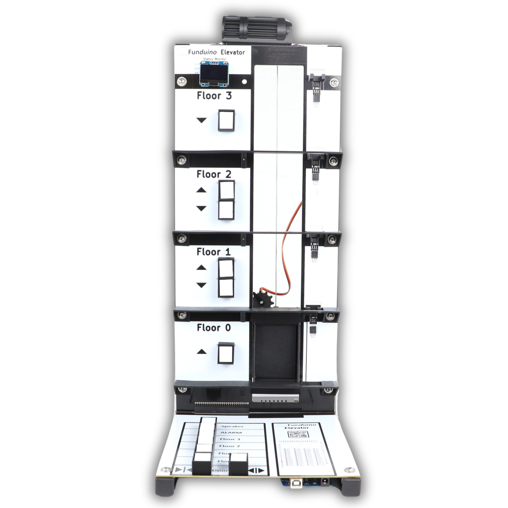 
Figura 1.1: Vista general del kit educativo Fundino elevador [1].

### Ascensor Encoder

Los encoders son dispositivos que pueden convertir la posición o el movimiento de un eje a señales digitales que pueden ser leídas por un controlador lógico programable. En el caso de este trabajo, el encoder ayuda a determinar la posición exacta de la cabina entre los pisos y asegurar paradas precisas y suaves, tal como se observa en la figura 1.2 [2]. 

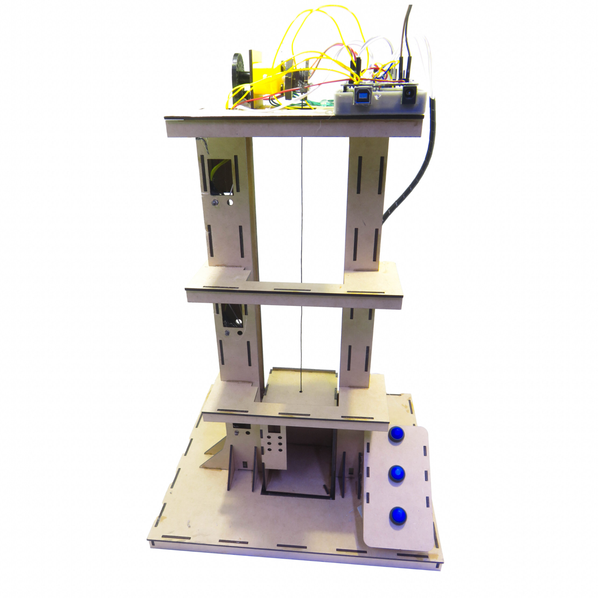 
Figura 1.2: Ascensor Ecopech de 3 pisos con Encoder [2].

La tabla 1.1 contrasta las prestaciones de los dos productos comerciales de referencia contra el prototipo desarrollado en este trabajo.

Tabla 1.1: Comparación de prestaciones entre productos comerciales y el prototipo desarrollado.
| Aspecto | Funduino Elevator (4 niveles) | Ascensor Ecopech (3 pisos con Encoder) | Prototipo desarrollado (Ascensor Inteligente) |
| :--- | :--- | :--- | :--- |
| **Paradas** | 4 niveles | 3 pisos | 3 (Planta Baja, Piso 1 y Piso 2) |
| **Capacidad** | Maqueta educativa | Maqueta educativa | Detección de sobrecarga por celda de carga (umbral configurable) |
| **Máquina de tracción** | Motor DC con reductor y puente en H L293D | Motor DC | Motor DC con driver L298N y control por PWM |
| **Comandos** | Lógica 5 V (Funduino MEGA 2560 R3) | Lógica 5 V (Arduino Nano) | Lógica 3,3 V a 5 V (STM32F103) |
| **Interfaz de usuario** | Pantalla OLED, botoneras de piso y panel interior | Sensor Encoder y Buzzer (sin pantalla incluida) | Pantalla LCD 16x2 (I2C) y botoneras interior/exterior |
| **Seguridad** | Barreras de luz por nivel y botón de alarma | Encoder para paradas precisas y suaves | Celda de carga (HX711) y botón de emergencia absoluto |
| **Registro / Telemetría** | Conexión opcional para Bluetooth | No especificado | Telemetría en tiempo real mediante Bluetooth (HM-10) |
| **Persistencia** | Basada en la memoria interna del microcontrolador | No especificado | Parámetros configurables persistidos en Flash interna |
| **Infraestructura** | Bastidor de perfil de aluminio 20x20 | Estructura en MDF y piezas 3D | Maqueta experimental de laboratorio |

En resumen, el mercado ofrece desde kits educativos básicos basados en Arduino con lógica simplificada, hasta instalaciones industriales certificadas de alto costo y código cerrado. Ninguna de estas soluciones combina la flexibilidad de un desarrollo Bare Metal en STM32 con funciones de seguridad avanzada (celda de carga) y telemetría activa por Bluetooth en un formato de aprendizaje abierto. Esto justifica el desarrollo de un sistema propio que integre control de precisión y auditoría remota con hardware accesible.

## 1.3. Alcance y limitaciones

**Alcance implementado:**
- Electrónica de control: Gestión de 3 paradas con lógica automática y control de motor por PWM.
- Interfaz de usuario: Botoneras (internas y externas), display LCD 16x2 y telemetría Bluetooth.
- Seguridad: Detección de sobrecarga (HX711) y botón de emergencia con prioridad absoluta.
- Configuración: Modo SET_UP con persistencia de parámetros en Flash interna.

**Fuera de alcance actual:**
- Diseño mecánico de infraestructura civil o edificio real (maqueta demostrativa).
- Escalabilidad a más de 3 paradas por restricciones de tiempo y presupuesto.

# Capítulo 2: Introducción específica

## 2.1. Requisitos del trabajo

En la tabla 2.1 se detallan los principales requisitos funcionales del sistema.

Tabla 2.1: Requisitos del proyecto.
| Grupo | ID | Descripción |
| :---- | :---- | :---- |
| Movimiento | 1.1 | El sistema desplazará la cabina entre 3 paradas: Planta Baja, Piso 1 y Piso 2. |
| | 1.2 | El sistema detectará la llegada a cada piso mediante un sensor reed switch dedicado. |
| | 1.3 | El sistema controlará la velocidad del motor mediante PWM. |
| | 1.4 | Si el viaje excede un tiempo máximo sin detectar llegada, el sistema pasará a estado de FALLA. |
| Llamado de piso | 2.1 | El sistema permitirá solicitar un piso mediante botonera externa e interna. |
| | 2.2 | El sistema encolará pedidos pendientes si se solicitan mientras el ascensor está en movimiento. |
| Puerta | 3.1 | El sistema abrirá la puerta automáticamente al llegar a un piso. |
| | 3.2 | El sistema cerrará la puerta automáticamente tras un tiempo configurable de espera. |
| | 3.3 | El sistema verificará el cierre de puerta mediante sensor reed switch antes de iniciar un viaje. |
| Seguridad | 4.1 | El sistema detendrá el ascensor y abrirá la puerta ante la activación de la llave de emergencia. |
| | 4.2 | El sistema detectará sobrecarga mediante celda de carga y bloqueará nuevos viajes. |
| | 4.3 | El sistema emitirá señales sonoras distintivas para llegada, tecla, sobrecarga, emergencia y falla. |
| Control de acceso | 5.1 | El sistema leerá el UID de tarjetas RFID mediante el módulo RC522. |
| | 5.2 | El sistema podrá restringir el llamado de piso a tarjetas autorizadas. |
| Interfaz de usuario | 6.1 | El sistema mostrará el piso actual y el estado del ascensor en un display LCD 16x2 por I2C. |
| | 6.2 | El sistema indicará mediante LEDs el estado de movimiento, puerta, SET_UP, falla y emergencia. |
| | 6.3 | El sistema permitirá control remoto mediante Bluetooth (HM-10). |
| Configuración | 7.1 | El sistema contará con un modo SET_UP con menú interactivo por LCD y botones. |
| | 7.2 | El sistema permitirá configurar: tiempo de puerta abierta, umbral de sobrecarga y velocidad del motor. |
| | 7.3 | La configuración persistirá en Flash interna del microcontrolador entre reinicios. |
| Arquitectura | 8.1 | El sistema se implementará Bare Metal, sin sistema operativo, bajo el paradigma Event-Triggered. |
| | 8.2 | El sistema utilizará un ejecutor cíclico con una vuelta completa menor a 1 ms. |
| | 8.3 | El sistema utilizará una base de tiempo de 1 ms (SysTick) para todas las temporizaciones. |
| | 8.4 | Todas las tareas serán no bloqueantes, sin uso de HAL_Delay en la lógica de aplicación. |

## 2.2. Casos de uso

En esta sección se describen los cuatro casos de uso principales del sistema. En la tabla 2.2 se presenta el llamado del ascensor desde un piso, en la tabla 2.3 la activación de la llave de emergencia, en la tabla 2.4 la configuración de parámetros en modo SET_UP y en la tabla 2.5 el control de acceso mediante tarjeta RFID.

Tabla 2.2: Caso de uso 1.
| Elemento | Definición |
| :---- | :---- |
| Disparador | Un usuario presiona el botón externo de llamado en Planta Baja, Piso 1 o Piso 2. |
| Precondiciones | El sistema está en modo NORMAL, en estado IDLE, sin sobrecarga activa. |
| Flujo principal | El botón genera un evento de pedido de piso, que se encola en la lista de pedidos pendientes. Si el ascensor está en IDLE, cierra la puerta, viaja al piso solicitado controlando el motor por PWM, detiene el motor al detectar el reed switch del piso destino, y abre la puerta automáticamente. |

Tabla 2.3: Caso de uso 2.
| Elemento | Definición |
| :---- | :---- |
| Disparador | El usuario acciona la llave de emergencia mientras el ascensor está en movimiento. |
| Precondiciones | El sistema está en cualquier estado que no sea ya EMERGENCIA. |
| Flujo principal | El sistema detiene el motor de inmediato, abre la puerta, enciende el LED de emergencia, activa el buzzer en patrón continuo y muestra el aviso en el LCD. El sistema permanece en este estado hasta que la llave vuelve a su posición normal. |

Tabla 2.4: Caso de uso 3.
| Elemento | Definición |
| :---- | :---- |
| Disparador | El usuario mantiene presionado el botón interno de Planta Baja durante el encendido. |
| Precondiciones | El sistema está apagado o acaba de reiniciarse. |
| Flujo principal | El sistema arranca en modo SET_UP. El usuario navega entre los parámetros configurables usando el botón de Planta Baja como navegar y el de Piso 2 como incrementar valor. Al confirmar con la llave de emergencia, el sistema persiste los valores en Flash interna y puede reiniciarse. |

Tabla 2.5: Caso de uso 4.
| Elemento | Definición |
| :---- | :---- |
| Disparador | El usuario acerca una tarjeta o llavero RFID al módulo RC522. |
| Precondiciones | El sistema tiene habilitado el control de acceso. |
| Flujo principal | El sistema lee el UID de la tarjeta mediante el protocolo REQA. Si el UID coincide con la lista de tarjetas autorizadas, se habilita el llamado de piso; caso contrario, se rechaza el pedido y se indica mediante LCD y buzzer. |

## 2.3. Elementos de hardware

### 2.3.1. Placa de desarrollo

Como unidad central de procesamiento se utilizó la placa STM32 Nucleo-F103RB, que se muestra en la figura 2.1, compatible con el ecosistema HAL. Esta placa gestiona toda la lógica del ascensor mediante una máquina de estados, el manejo de tiempos críticos mediante SysTick y TIM2 (PWM), y la comunicación con los periféricos mediante I2C1, SPI1 y USART3.

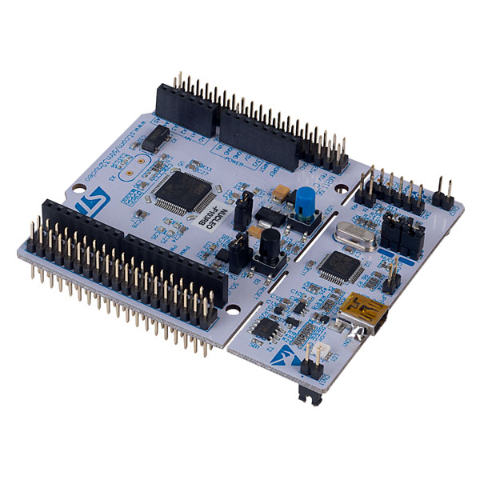 
Figura 2.1: Placa de desarrollo Nucleo-F103RB utilizada.

### 2.3.2. Motor y driver L298N

Se utilizó un motorreductor DC de 12 V acoplado a una polea para el sistema de tracción de la cabina, controlado a través de un driver L298N [3] en configuración de puente H, tal como se muestra en la figura 2.2. La dirección de giro se controla mediante los pines IN1 e IN2, y la velocidad mediante PWM sobre el pin ENA.

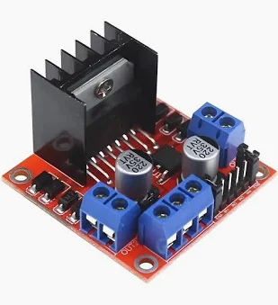 
Figura 2.2: Motorreductor y driver L298N.

### 2.3.3. Celda de carga y amplificador HX711

Para la detección de sobrecarga se utilizó una celda de carga tipo barra recta de 3 kg, junto al amplificador HX711 [4], que entrega el dato mediante un protocolo propio de dos hilos (DT y SCK). Ambos componentes se ilustran en la figura 2.3.

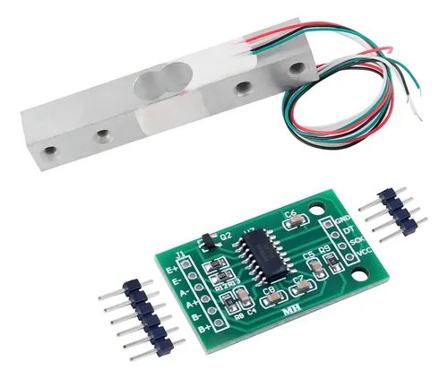 
Figura 2.3: Celda de carga y amplificador HX711.

### 2.3.4. Display LCD 16x2

Se utilizó un display LCD 16x2 con interfaz I2C (PCF8574), que se observa en la figura 2.4 y muestra el piso actual, el estado del ascensor y el menú de configuración.

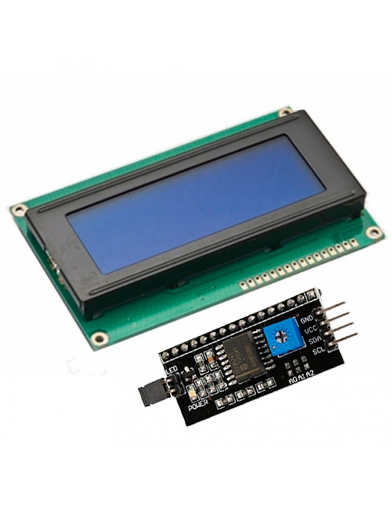 
Figura 2.4: Pantalla LCD 16x2 I2C utilizada.

### 2.3.5. Módulo RFID RC522

Se integró un módulo lector RFID (Radio Frequency Identification, Identificación por Radiofrecuencia) RC522 [5], que se muestra en la figura 2.5, por bus SPI1, utilizado para el control de acceso opcional mediante tarjetas y llaveros.

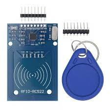 
Figura 2.5: Módulo lector RFID RC522.

### 2.3.6. Módulo Bluetooth HM-10

Se utilizó el módulo HM-10 (Bluetooth Low Energy) de la figura 2.6, conectado a USART3, para permitir el llamado de piso de forma remota desde una aplicación móvil.

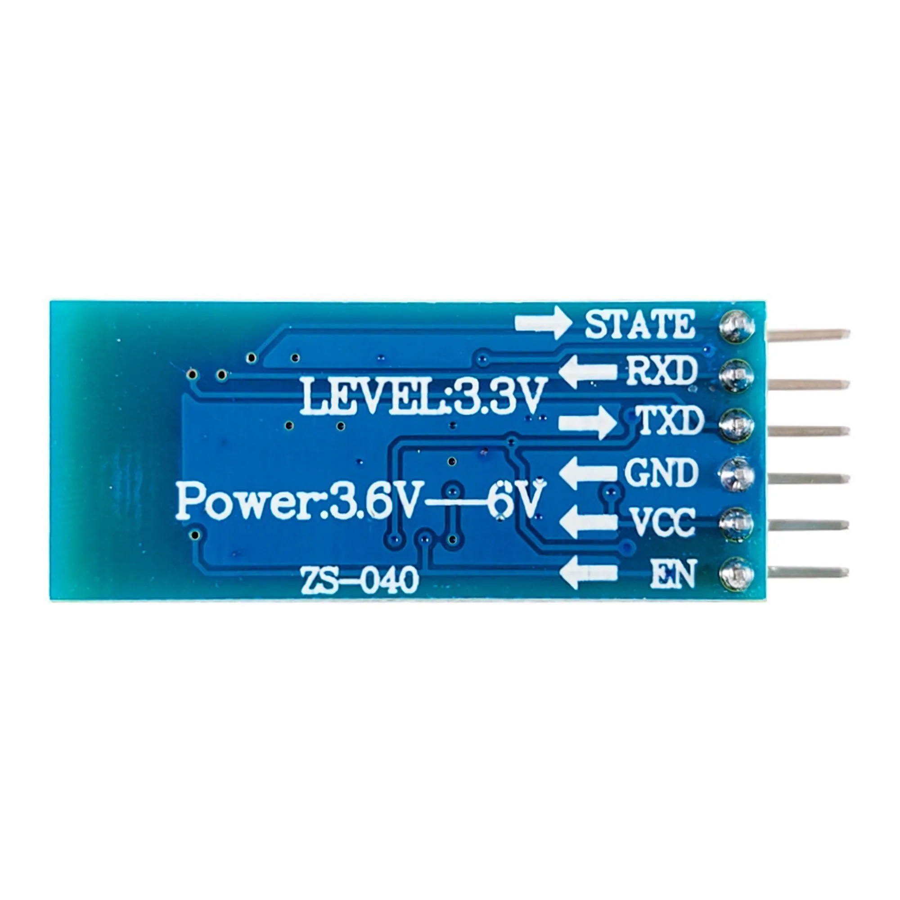 
Figura 2.6: Módulo Bluetooth HM-10.

### 2.3.7. Botones, reed switches y llave de emergencia

Se utilizaron seis pulsadores para las botoneras, tres sensores magnéticos reed switch para la detección de llegada a los pisos, y una llave de emergencia de tipo interruptor mantenido. Los pulsadores y los sensores se muestran en la figura 2.7.

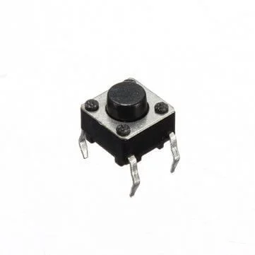 
Figura 2.7: Botones y sensores magnéticos utilizados.

### 2.3.8. LEDs y buzzer

Se utilizaron tres LEDs indicadores y un buzzer activo, ilustrados en la figura 2.8, para la señalización visual y sonora de los eventos del sistema.

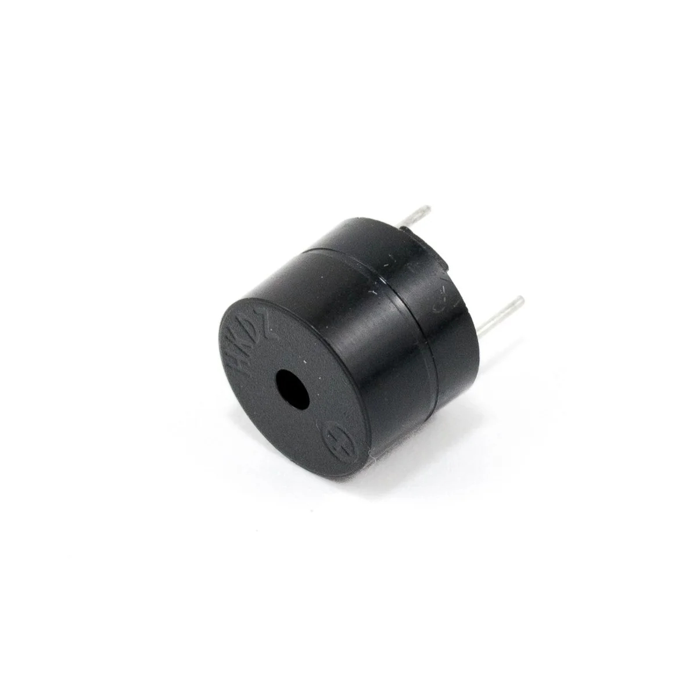 
Figura 2.8: LEDs y buzzer activo.

# Capítulo 3: Diseño e implementación

## 3.1. Esquema eléctrico y conexionado

Para la integración física del sistema se utilizó una placa experimental soldada, sin uso de protoboard, con interconexión de componentes mediante cables soldados. El circuito se centra en la placa Nucleo-F103RB, que gestiona los periféricos mediante las siguientes interfaces:

- GPIO (entradas): Botones de llamado externo e interno, reed switches de piso, llave de emergencia.
- GPIO (salidas): LEDs indicadores, buzzer, direccionamiento del motor (IN1 e IN2).
- PWM (TIM2_CH1): Control de velocidad del motor a través del pin ENA del L298N.
- I2C1 (PB8=SCL, PB9=SDA): Display LCD.
- SPI1 (PA5=SCK, PA6=MISO, PA7=MOSI): Módulo RFID RC522.
- USART3 (PB10=TX, PB11=RX): Módulo Bluetooth HM-10.
- Interfaz de 2 hilos (PC4=DT, PC5=SCK): Amplificador de celda de carga HX711.

En la tabla 3.1 se detalla la asignación completa de pines. En la figura 3.1 se muestra la configuración de pines realizada en STM32CubeMX, en las figuras 3.2 y 3.3 la placa experimental soldada vista de frente y de dorso, y en las figuras 3.4 y 3.5 la maqueta mecánica completa vista de frente y de dorso.

Tabla 3.1: Asignación de pines del sistema.
| Bloque | Señal | Pin STM32 | Configuración |
| :---- | :---- | :---- | :---- |
| Reed switches | PB / P1 / P2 | PC6 / PC7 / PC8 | GPIO_Input |
| Botones externos | PB / P1 / P2 | PC9 / PC10 / PC11 | GPIO_Input |
| Botonera de cabina | PB / P1 / P2 | PC12 / PB1 / PB2 | GPIO_Input |
| Llave de emergencia | — | PB12 | GPIO_Input |
| LEDs de piso | PB / P1 / P2 | PB3 / PB4 / PB5 | GPIO_Output |
| Buzzer | — | PB13 | GPIO_Output |
| Motor L298N | IN1 / IN2 | PC0 / PC1 | GPIO_Output |
| Motor L298N | ENA | PA0 | TIM2_CH1 (PWM) |
| LCD I2C1 | SCL / SDA | PB8 / PB9 | I2C1 |
| RC522 SPI1 | SCK / MISO / MOSI | PA5 / PA6 / PA7 | SPI1 |
| RC522 | RST / CS | PA9 / PB6 | GPIO_Output |
| HX711 | DT / SCK | PC4 / PC5 | GPIO_Input / GPIO_Output |
| HM-10 USART3 | TX / RX | PB10 / PB11 | USART3 |

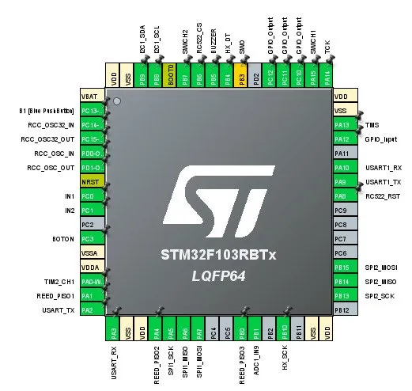 
Figura 3.1: Configuración de pines en STM32CubeMX.

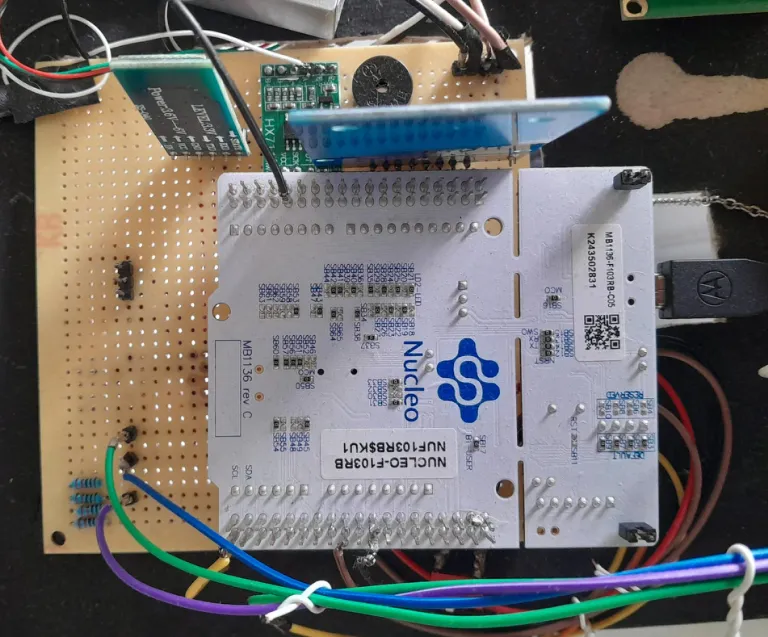 
Figura 3.2: Placa experimental soldada vista de frente.

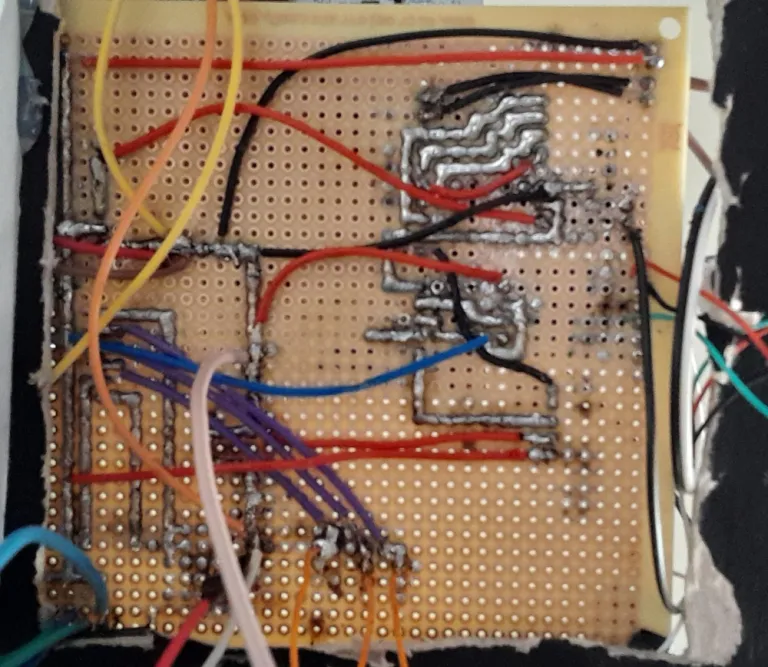 
Figura 3.3: Placa experimental soldada vista de dorso.

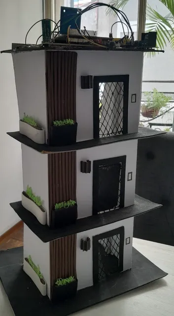 
Figura 3.4: Maqueta mecánica completa del ascensor de frente.

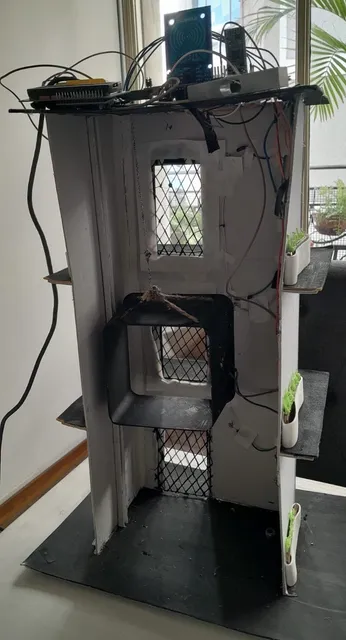 
Figura 3.5: Maqueta mecánica completa del ascensor de dorso.

## 3.2. Descripción del comportamiento (máquina de estados)

El comportamiento del ascensor se modela mediante una máquina de estados finitos con los siguientes estados: IDLE, PUERTA_ABRIENDO, PUERTA_ABIERTA, PUERTA_CERRANDO, VIAJANDO, EMERGENCIA y FALLA.

Desde el estado IDLE, ante un pedido de piso pendiente, el sistema transiciona a PUERTA_CERRANDO. Al confirmarse el cierre por el sensor de puerta, se pasa a VIAJANDO, activando el motor en la dirección correspondiente y armando un temporizador de viaje (watchdog). Al detectar la llegada al piso destino mediante el sensor magnético, se detiene el motor y se transiciona a PUERTA_ABRIENDO y luego a PUERTA_ABIERTA, donde permanece durante un tiempo configurable antes de volver a cerrar.

Los estados EMERGENCIA y FALLA tienen prioridad absoluta. Cualquier evento de activación de la llave de emergencia interrumpe el estado actual y lleva al sistema a EMERGENCIA. El estado FALLA se alcanza si el temporizador de viaje vence sin detectar llegada. La figura 3.6 muestra el diagrama completo de estas transiciones.

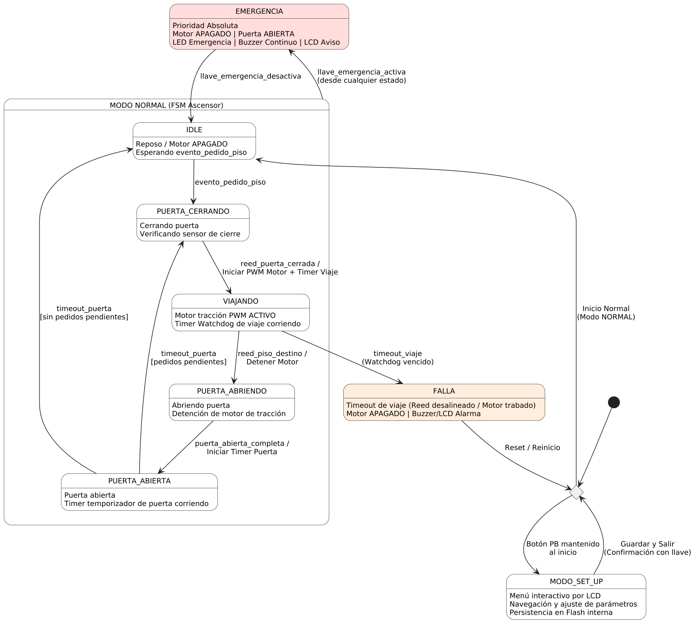 
Figura 3.6: Máquina de estados finitos del sistema.

## 3.3. Arquitectura del firmware

El firmware se estructura en las etapas de escrutar, procesar y actuar, comunicadas mediante una cola de eventos, sobre un ejecutor cíclico con un tick de 1 ms. Ningún módulo utiliza demoras bloqueantes en su lógica de operación regular. La figura 3.7 ilustra este flujo.

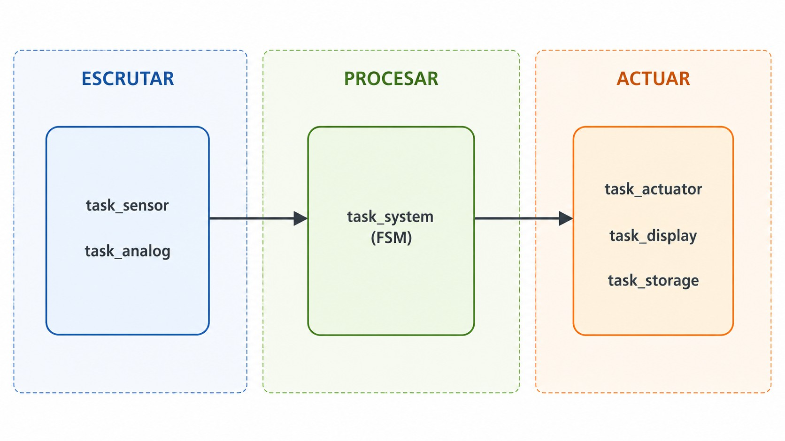 
Figura 3.7: Orden de despacho de las tareas dentro de una vuelta del ejecutivo cíclico.

### 3.3.1. Módulo tick

Provee la base de tiempo de 1 ms mediante el callback de SysTick, y una utilidad de temporizador no bloqueante usada por todos los demás módulos para medir tiempos sin detener el procesador.

### 3.3.2. Módulo eventos

Implementa una cola circular (array de estructuras) que desacopla la etapa de escrutar de la etapa de procesar. Cualquier fuente de entrada empuja el mismo tipo de evento, permitiendo que la máquina de estados no distinga el origen.

### 3.3.3. Módulo escrutar

Realiza el polling con antirrebote por software de los botones, los reed switches y la llave de emergencia, junto con la lectura de la celda de carga, generando eventos ante cada cambio de estado.

### 3.3.4. Módulo máquina de estados finitos (FSM) ascensor

Implementa la máquina de estados descrita en la sección 3.2, incluyendo la lista de pedidos pendientes por piso y la lógica de selección del próximo destino.

### 3.3.5. Módulo actuadores

Conjunto de controladores de bajo nivel para el motor, los LEDs, el buzzer y la pantalla LCD.

### 3.3.6. Módulo configuración (Flash interna)

Persiste los parámetros configurables en un sector de la memoria Flash interna del STM32F103RB, con verificación por suma de comprobación ante lecturas de sectores no inicializados.

### 3.3.7. Módulo RFID (RC522)

Implementa la inicialización del lector y la obtención del código identificador mediante el protocolo SPI1, comparándolo contra una lista de usuarios autorizados.

### 3.3.8. Módulo Bluetooth (HM-10)

Gestiona la recepción de comandos por el bus USART3 mediante interrupciones, permitiendo el llamado de piso remoto.

# Capítulo 4: Ensayos y resultados

## 4.1. Prueba de integración (video)

En el video disponible en el siguiente enlace [VIDEO](https://drive.google.com/file/d/1JfSwkdtGOohkIxRKn3G9b7csXOrkRucz/view?usp=sharing) se muestra el funcionamiento completo del prototipo, partiendo desde el estado de reposo hasta la llegada exitosa al piso solicitado. Asimismo, se expone la respuesta del sistema ante el bloqueo por sobrecarga y la interrupción inmediata del viaje al accionar el botón de emergencia.

## 4.2. Pruebas funcionales de hardware y firmware

En la tabla 4.1 se resumen las pruebas realizadas para validar el funcionamiento de los distintos componentes físicos y lógicos.

Tabla 4.1: Resumen de ensayos funcionales de hardware y firmware.
| Subsistema | Ensayo realizado | Resultado y criterio de validación | Estado |
| :--- | :--- | :--- | :---: |
| Hardware | Verificación de continuidad | Ausencia de cortocircuitos o falsos contactos en la placa experimental | ✅ |
| Hardware | Respuesta de botoneras y sensores | Mapeo correcto de las entradas a sus respectivos eventos | ✅ |
| Hardware | Visualización del LCD | Actualización en tiempo real del piso actual y mensajes de estado | ✅ |
| Hardware | Funcionamiento de la celda de carga | Lectura estable y detección de sobrecarga ante un peso conocido | ✅ |
| Firmware | Antirrebote de pulsadores | Filtrado exitoso de rebotes mecánicos sin pérdida de eventos | ✅ |
| Firmware | Interpretación de la celda de carga | Mapeo estable de las lecturas del HX711 | ✅ |
| Firmware | Persistencia de datos | Lectura y escritura correcta de parámetros de configuración | ✅ |
| Firmware | Máquina de estados global | Transiciones robustas con prioridad absoluta de la emergencia | ✅ |

## 4.3. Salida de consola y Build Analyzer

Al finalizar la compilación, el entorno genera el reporte de uso de memoria. La figura 4.1 muestra este reporte, sirviendo como evidencia de que el firmware del ascensor compila correctamente.

 
Orden de despacho
Figura 4.1: Reporte de uso de memoria RAM y FLASH en STM32CubeIDE.

Con el fin de facilitar la interpretación de estos resultados, la tabla 4.2 desglosa el aporte de cada sección del binario a la ocupación real de las regiones físicas de memoria del microcontrolador.

Tabla 4.2: Desglose de secciones del binario y ocupación de memoria.
| Región física | Usado [Bytes] | Total disponible [Bytes] | Ocupación |
| :--- | :---: | :---: | :---: |
| RAM | 3,16 KB | 20 KB | 15,78 % |
| FLASH |  43,23 KB | 128 KB | 33,77 % |

Como se desprende de la métrica final, el firmware utiliza aproximadamente un 16 % de la memoria de programa (FLASH) disponible y un 34 % de la memoria dinámica (RAM), dejando un margen operativo holgado. No se observaron fallos ni advertencias del compilador.

## 4.4. Medición y análisis de tiempos de ejecución (WCET)

En esta sección se busca comprender el comportamiento temporal del programa. Para esto se observa la variable WCET (Worst-Case Execution Time), que muestra el peor caso de ejecución de una tarea. La figura 4.2 muestra los resultados observados en el depurador.

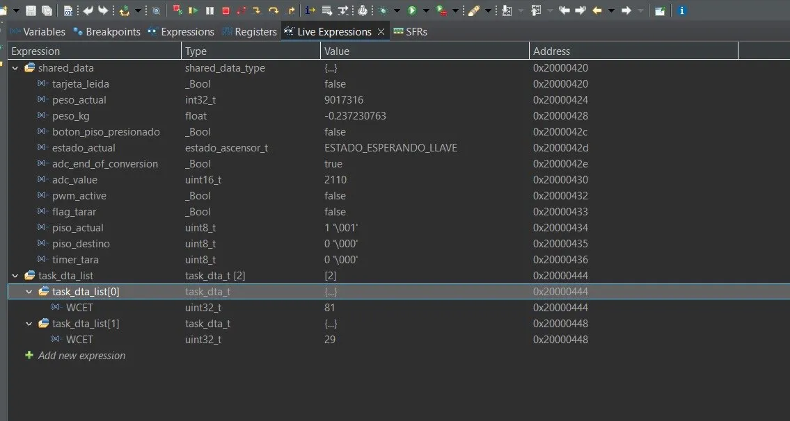 
Figura 4.2: Pantalla de Live Expressions con los peores tiempos de ejecución en microsegundos.

En la tabla 4.3 se detalla el WCET medido de cada tarea fundamental del ciclo.

Tabla 4.3: Peores casos de tiempo de ejecución según tarea.
| Tarea | WCET medido (µs) |
| :--- | :---: |
| task_dta_list[0] | 81 |
| task_dta_list[1] | 29 |
| **Total del ciclo completo** | **110** |

En el peor de los casos se obtiene un tiempo total de 110 µs. Este resultado cumple holgadamente con el requisito de tiempo del ejecutor cíclico de 1000 µs (1 ms), dejando un amplio margen operativo disponible de 890 µs en cada vuelta. La tarea que resultó más costosa (81 µs) es la que concentra el escrutinio de entradas y el procesamiento de la máquina de estados.

## 4.5. Cálculo del factor de uso (U) de la CPU

El factor de uso de la CPU se define como el cociente entre el tiempo de cómputo del peor caso (C) y el período de despacho del ejecutor cíclico (T), según la ecuación (4.1).

$$U = \frac{C}{T} \qquad (4.1)$$

Reemplazando C con el WCET total obtenido en la tabla 4.3 (110 µs) y asumiendo T = 1000 µs, se obtiene un factor de uso de 0,11 (es decir, un 11 % del tiempo disponible en cada vuelta del ciclo). Esto deja un 89 % del tiempo libre para el procesador. Dado que la condición de planificabilidad se cumple con holgura, se concluye que el factor de uso es acorde a los requisitos de tiempo real del sistema.

## 4.6. Medición y análisis de consumo

Se midió el consumo energético del sistema colocando un amperímetro en serie con la alimentación sobre los rieles de 3,3 V y 5 V. La potencia consumida se calcula mediante la ecuación (4.2).

$$P = V \times I \qquad (4.2)$$

La tabla 4.4 resume el consumo medido en los distintos modos de operación.

Tabla 4.4: Consumo energético del sistema por modo de operación y riel de alimentación.
| Modo de operación | Riel | Corriente consumida [mA] | Potencia consumida [mW] |
| :--- | :---: | :---: | :---: |
| Reposo (sin pedidos pendientes) | 3,3 V | 45 | 148,5 |
| Reposo (sin pedidos pendientes) | 5 V | 45 | 225 |
| Viaje en curso (motor y driver activos) | 3,3 V | 55 | 181,5 |
| Viaje en curso (motor y driver activos) | 5 V | 350 | 1750 |
| LCD y Bluetooth activos | 3,3 V | 60 | 198 |

Como se observa en la tabla 4.4, el mayor consumo del sistema se concentra en el riel de 5 V durante un viaje en curso, alcanzando un pico de 350 mA, producto de la corriente que demanda el motor DC. El resto de las condiciones operan en un rango de 45 mA a 60 mA, dominado por el consumo estático de los periféricos digitales.

## 4.7. Cumplimiento de requisitos

En la tabla 4.5 se describe la leyenda de colores utilizada para indicar el estado de cada requisito, y en la tabla 4.6 se presenta la matriz de cumplimiento de los requisitos definidos en la tabla 2.1.

Tabla 4.5: Descripción de la leyenda de estado.
| Estado | Descripción |
| :---: | :--- |
| 🟢 | Implementado |
| 🟡 | Parcialmente implementado |
| 🔴 | No implementado |

Tabla 4.6: Matriz de cumplimiento de requisitos técnicos del trabajo.
| Grupo | ID | Descripción | Estado |
| :---- | :---- | :---- | :----: |
| Movimiento | 1.1 | 3 paradas (Planta Baja, Piso 1, Piso 2) |  🟢 |
| | 1.2 | Detección de llegada por reed switch | 🟢 |
| | 1.3 | Control de velocidad por PWM | 🟡 |
| | 1.4 | Watchdog de viaje (timeout a estado de falla) | 🟡 |
| Llamado de piso | 2.1 | Botonera externa e interna | 🟢 |
| | 2.2 | Cola de pedidos pendientes | 🟢 |
| Puerta | 3.1 | Apertura y cierre automático con sensor | 🔴 |
| Seguridad | 4.1 | Emergencia, sobrecarga y uso del buzzer | 🟢 |
| Control de acceso | 5.1 | Lectura y validación de UID (RC522) | 🟢 |
| Interfaz de usuario | 6.1 | Funciones del LCD, LEDs y módulo Bluetooth | 🟢 |
| Configuración | 7.1 | Menú SET_UP con persistencia en Flash | 🟡 |
| Arquitectura | 8.1 | Bare metal, super-loop, tick de 1 ms no bloqueante | 🟢 |

# Capítulo 5: Conclusiones

## 5.1. Resultados obtenidos

Se logró un prototipo funcional que integra control de movimiento entre pisos, lectura de tarjetas RFID para el acceso, detección de sobrecarga mediante celda de carga, interfaz local por LCD y telemetría por Bluetooth, todo sobre una arquitectura Bare Metal con ejecutivo cíclico y tick de 1 ms.

Durante el desarrollo surgieron varias dificultades. La lectura de la celda de carga mediante el protocolo del HX711 resultó sensible a los tiempos de espera entre flancos de reloj. La comunicación con el módulo RC522 representó un desafío al implementarse sin recurrir a una librería externa, lo que exigió depurar manualmente cada trama. Por último, la calibración mecánica de la cabina requirió varias iteraciones de prueba y ajuste sobre la maqueta.

## 5.2. Próximos pasos

Si bien el prototipo cumple con los objetivos funcionales planteados, quedaron identificadas varias líneas de mejora para una futura iteración:

1. Implementar un modo de bajo consumo real mediante comandos de suspensión durante los períodos de espera sin eventos pendientes.
2. Agregar control de velocidad real por PWM sobre el motor, aprovechando que el hardware ya está preparado.
3. Sumar autenticación de sectores en el RC522 en lugar de validar solo el identificador de la tarjeta, para elevar el nivel de seguridad del control de acceso.
4. Mejorar la aplicación de Bluetooth incorporando confirmación de comandos recibidos y no solo el envío de estado del sistema.

# Capítulo 6: Uso de herramientas de IA

Se documenta a continuación el uso de herramientas de inteligencia artificial durante el desarrollo del trabajo.

Se utilizó IA como apoyo en las siguientes tareas:
- Corrección de errores en los informes: Revisión y corrección de redacción, ortografía y estructura de la memoria técnica.
- Programación STM32: Apoyo en la estructura y funcionamiento del firmware.
- Depuración y resolución de problemas: Consultas sobre errores de compilación y comportamientos inesperados del microcontrolador.

El uso de estas herramientas permitió resolver de forma ágil dudas operativas, concentrando el esfuerzo del equipo en la lógica del sistema y la integración del prototipo.

# Capítulo 7: Bibliografía

[1] Fundino elevador. [Online]. Available: https://funduinoshop.com/es/educacion/funduino/ascensor-funduino/funduino-elevator-ascensor/elevador-para-arduino?srsltid=AfmBOopy4-ADLDJnJeEbezHpD-sw17suN0-LHIAc42m35cEGP_zn_UFD

[2] Ascensor Encoder. [Online]. Available: https://ecopechperu.com/producto/ascensor-03-pisos-con-encoder/

[3] L298N Datasheet. [Online]. Available: https://www.st.com/resource/en/datasheet/l298.pdf

[4] HX711 Datasheet. [Online]. Available: https://www.mouser.com/datasheet/2/813/hx711_english-1022875.pdf?srsltid=AfmBOoou08G0P2yIFVLCP-mif388n7Xlgudjj4iS-MJn1Mm1avX4v5oM

[5] MFRC522 Datasheet. [Online]. Available:  https://www.nxp.com/docs/en/data-sheet/MFRC522.pdf

[6] STM32F103RB Reference Manual. [Online]. Available:  https://www.st.com/resource/en/reference_manual/rm0390-stm32f446xx-advanced-armbased-32bit-mcus-stmicroelectronics.pdf

[7] A Beginner's Guide to Designing Embedded System Applications on Arm Cortex-M Microcontroller. [Online]. Available: https://www.arm.com/resources/education/books/designing-embedded-systems

[8] Campus Grado FIUBA - TA134. [Online]. Available:  https://campusgrado.fi.uba.ar/course/view.php?id=1217

[9] Repositorio del proyecto. [Online]. Available: https://github.com/Mardosreis/tdse-tf_1erC_1-03
